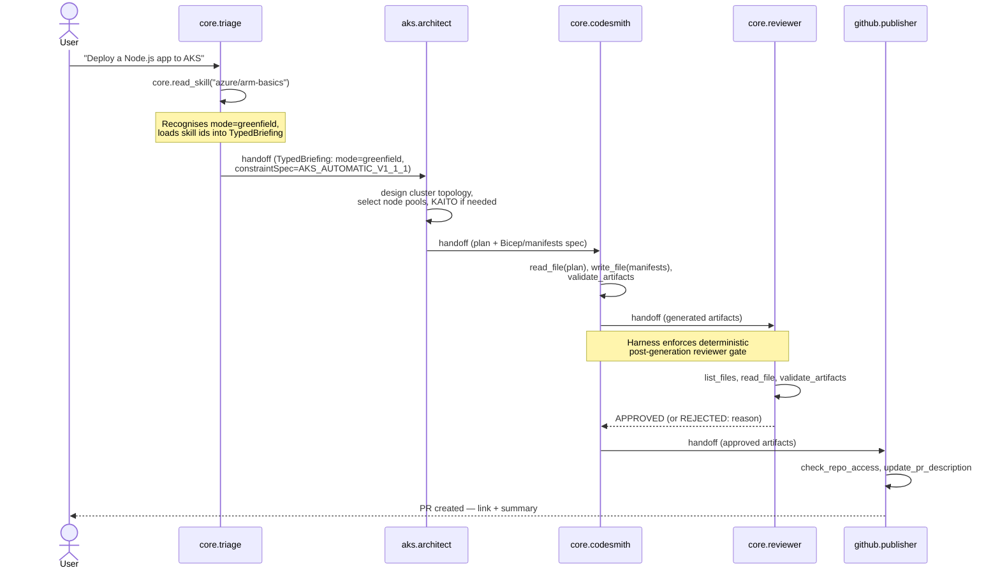
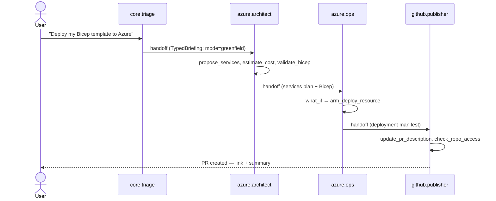
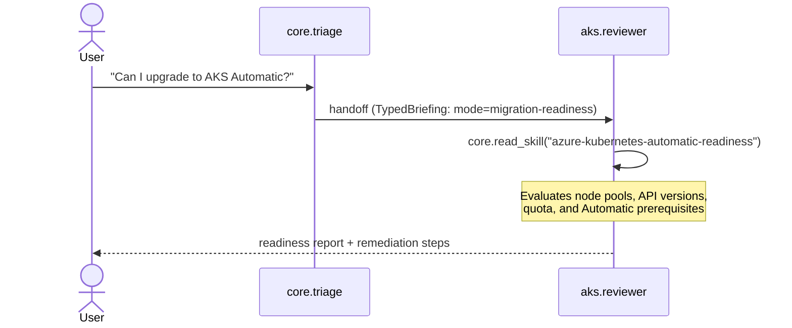
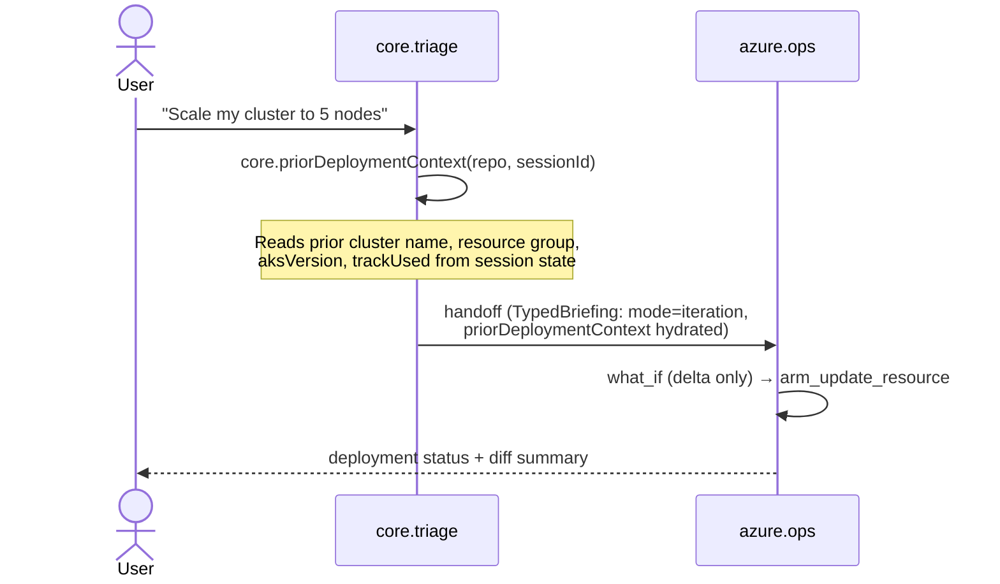

# Agent Coordination

How agents coordinate via handoff patterns, `asTools` wiring, question budgets, prior-deployment context, and the coordinator (triage) role.

## Overview

Kickstart uses a multi-agent architecture where a **coordinator agent** (the triage agent) routes conversations to specialist agents. Coordination happens through five mechanisms:

1. **Handoffs** — full ownership transfer from one agent to another.
2. **`asTools` consultation** — bounded, stateless queries to a specialist without transferring ownership.
3. **Question budgets** — `maxTurns` caps that prevent runaway consultation chains.
4. **CI enforcement** — typed handoff briefings validated at CI time to keep structured data out of prose.
5. **`priorDeploymentContext`** — cross-iteration context vehicle that carries prior-deployment metadata into the current session, enabling agents to reference what was deployed before without re-asking the user.

## Multi-Agent Flow Diagrams

### AKS Greenfield: Triage → Architect → Codesmith → Reviewer → Publisher

The canonical AKS greenfield path: triage recognises intent, routes to `aks.architect` for cluster design, then hands off through the codesmith → reviewer → publisher chain to produce reviewed, PR-ready artifacts.



### Azure Infrastructure: Triage → Azure Architect → Ops → Publisher

The Azure infrastructure path for Bicep/ARM deployments — no codesmith step; the architect drives the ops chain directly.



### Assessment Flow (AKS Automatic Readiness)

When the user asks about upgrading an existing cluster, triage routes to `aks.reviewer` which calls `core.read_skill("azure-kubernetes-automatic-readiness")` to evaluate readiness before proceeding.



### Iteration Flow (Delta Deploy)

When the user returns to iterate on a prior deployment, triage hydrates `priorDeploymentContext` and routes directly to `azure.ops` for a delta deploy — skipping the full greenfield architecture phase.



## The Coordinator Role (Triage)

The triage agent (`core.triage`) is the entry point for all user conversations. Its responsibilities:

- **Mode recognition** — classify the user's intent into a fixed enum (`iteration`, `handover`, `bulk`, `paas-migration`, `migration-readiness`, `greenfield`) using the typed `TriageModeSchema`.
- **Routing** — hand off to the appropriate specialist based on the recognized mode.
- **Consultation** — use `asTools` to ask specialists quick questions without relinquishing control.

```
User message
    │
    ▼
┌──────────────┐    asTools (bounded)     ┌─────────────────┐
│ core.triage  │◄────────────────────────►│ aks.architect   │
│ (coordinator)│                          │ azure.architect │
│              │                          │ core.codesmith  │
│              │──── handoff (transfer) ──►│ specialist      │
└──────────────┘                          └─────────────────┘
```

## Handoff Patterns

A handoff transfers full conversation ownership from one agent to another. Handoffs are declared in agent frontmatter:

```yaml
---
name: core.triage
handoffs:
  - label: Deploy to AKS
    agent: aks.architect
    send: true
  - label: Code generation
    agent: core.codesmith
    send: true
---
```

### Typed Handoff Briefing

When handing off, the coordinator constructs a **Handoff Briefing** — a typed payload (not free prose) validated by `TriageHandoffBriefingSchema` (parsed via `parseTriageHandoffBriefing`) in `packages/pack-core/src/triage/handoff-schema.ts`. This ensures:

- **Z1**: Constraint-spec version pin is carried as structured data.
- **Z2**: Downstream agents reference the typed slot, never raw user text.
- **Z3**: The recognized mode is a fixed enum, not raw prose.

```typescript
// Handoff briefing carries structured metadata
{
  version: 'triage-handoff/v1',         // schema version
  mode: 'migration-readiness',          // Z3: enum, not prose
  constraintSpec: {                     // Z1: typed slot
    safeguardSpecVersion: 'v1.1.1',
    aksVersion: '2026-03-15',
  },
  sourceSignals: [...],                 // evidence trail
  skillIdsLoaded: ['azure/arm-basics', ...],  // required skills
}
```

### Handoff vs `asTool` Decision

| Situation | Mechanism |
|-----------|-----------|
| Specialist should **own the conversation** going forward | Handoff |
| You need a specialist's answer to **continue your own task** | `asTool` |

**Rule of thumb:** If you will act on the answer and keep responding to the user, use `asTool`. If the specialist takes over, use handoff.

## `asTools` Wiring

The `asTool()` harness wrapper exposes any agent as a callable tool for bounded, stateless consultation. Declare in frontmatter:

```yaml
---
name: aks.architect
asTools:
  - agent: azure.architect
    description: Consult for cross-domain VNET/DNS questions.
    maxTurns: 3
  - agent: core.codesmith
    description: Generate infrastructure code mid-diagnosis.
    maxTurns: 5
---
```

Each entry generates a tool named `ask_<sanitised_agent_name>` (e.g., `ask_azure_architect`).

### Current Wired Pairs

Extracted verbatim from `config/handoff-rules.json` (authoritative source). All 7 wired pairs are documented below.

| Caller | Specialist | Tool name | maxTurns | Use case |
|--------|-----------|-----------|----------|----------|
| `core.triage` | `aks.architect` | `ask_aks_architect` | 3 | AKS design questions during triage |
| `core.triage` | `azure.architect` | `ask_azure_architect` | 3 | Azure infra questions during triage |
| `aks.architect` | `azure.architect` | `ask_azure_architect` | 3 | Cross-domain VNET/DNS/Private Link |
| `aks.architect` | `core.codesmith` | `ask_core_codesmith` | 5 | Generate infra code mid-diagnosis |
| `core.codesmith` | `core.reviewer` | `ask_core_reviewer` | 3 | Immediate quality review of generated code |
| `azure.architect` | `aks.architect` | `ask_aks_architect` | 3 | Symmetric AKS consultation (node pools, Gateway API, KAITO) |
| `github.publisher` | `azure.architect` | `ask_azure_architect` | 3 | Cost lookup and deployment-target confirmation before publishing |

### Behaviour

- **Bounded** — capped at `maxTurns` (default 5) to prevent runaway chains.
- **Stateless** — no conversation history passes to the specialist; each call starts fresh.
- **Non-mutating** — the original agent object is never modified (cloned internally).
- **Text extraction** — returns plain string to the parent LLM.

### Track-Flip / Reshape Locally (No Handback to Triage)

No agent in the current wiring has `core.triage` as a handoff target. This was a documented gap (`no-handback-to-triage` in `config/handoff-rules.proposed.json`): if a user changes track mid-conversation (e.g., "use Container Apps instead of AKS" in Sim #8), there was no clean route back to the coordinator.

**Decision (Sim #8 Stefan, 2026-05):** The **reshape-locally** pattern is the approved workaround and no triage-handback wiring is required. When a user requests a track flip, the current specialist reshapes the plan in-place, updates the conversation context, and continues — rather than handing back to triage for re-routing. This avoids a round-trip through the coordinator for what is often a minor scope adjustment.

> **Rule:** If the user names a different service (e.g., Container Apps vs AKS), reshape locally. If the user describes a fundamentally different workload shape (e.g., greenfield cluster → PaaS migration), escalate via a new conversation entry through triage.

## Question Budgets

To prevent infinite consultation loops and control cost, each agent-to-agent interaction is bounded by a **question budget**:

- `asTools` calls are capped by `maxTurns` per consultation (configurable per wired pair).
- The default cap is `AS_TOOL_MAX_TURNS_DEFAULT = 5` turns per invocation.
- The runner enforces a global turn limit across the entire conversation chain.

These budgets ensure:
1. Specialist consultations are focused and concise.
2. Costs remain predictable (each turn = one LLM call).
3. Runaway loops are impossible — the harness hard-stops at the budget limit.

## `priorDeploymentContext`

The fifth coordination vehicle carries context about **prior deployments** across conversation iterations, enabling agents to reference what was deployed before without re-asking the user.

### Problem it solves

Triage has no built-in rule for recognising iteration on prior Kickstart deployments (Sim #9). Without this context, it falls into the greenfield architect-plan flow and re-proposes the cluster as if it were the first deployment.

### How it works

`core.priorDeploymentContext` is a session-scoped tool (Phase 3) — or `core.inspect_repo` + `core.read_file` as a Phase 2 fallback — that populates a `priorDeploymentContext` payload at session start when triage detects `mode: iteration`. The payload carries:

| Field | Description |
|-------|-------------|
| `clusterName` | Name of the previously deployed cluster |
| `resourceGroup` | Azure resource group of the prior deployment |
| `aksVersion` | Kubernetes version from prior deploy |
| `trackUsed` | Original track (`containerized_web`, `agentic_app`, etc.) |
| `deployedAt` | Approximate timestamp of the prior deployment |
| `priorConstraintSpec` | Safeguard spec version and AKS API version pinned at deploy time |

### Usage pattern

```typescript
// Triage reads prior context before routing
const priorCtx = await core.priorDeploymentContext({ repo, sessionId });
if (priorCtx) {
  briefing.priorDeploymentContext = priorCtx;  // typed slot, not prose
  briefing.mode = 'iteration';
}
```

Downstream agents (e.g., `aks.architect`) reference `briefing.priorDeploymentContext` to skip re-confirmation questions about cluster identity and instead jump directly to the delta between the prior state and the requested change.

### Status

`core.priorDeploymentContext` is implemented (`packages/pack-core/src/tools/prior_deployment_context.ts`). When triage detects `mode: iteration` it calls this tool to hydrate the `priorDeploymentContext` slot in the handoff briefing, enabling downstream agents to skip re-confirmation questions and jump directly to delta planning.

## CI Enforcement

The handoff schema is enforced at CI time:

- **`triage-handoff-ci-enforcement.test.ts`** — verifies every downstream agent prompt references the typed handoff slot (not raw user text).
- **`triage-handoff-schema.test.ts`** — validates briefing payloads against `TriageHandoffBriefingSchema`.
- **`triage-mode-recognition.test.ts`** — confirms mode classification produces valid enum values.

## Related

- [Agent as Tool (`asTool`)](../agent-authoring/agent-as-tool.md) — API reference and detailed usage.
- [Runner Chain](../agent-authoring/runner-chain.md) — for stateful multi-turn specialist interaction.
- [Conversation Phases](../agent-authoring/conversation-phases.md) — lifecycle of a multi-agent conversation.
