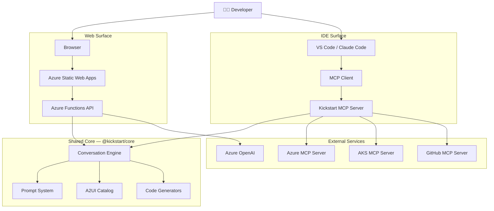
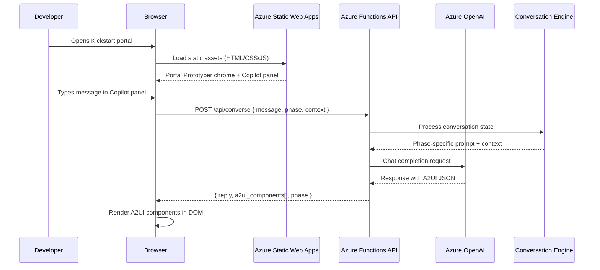
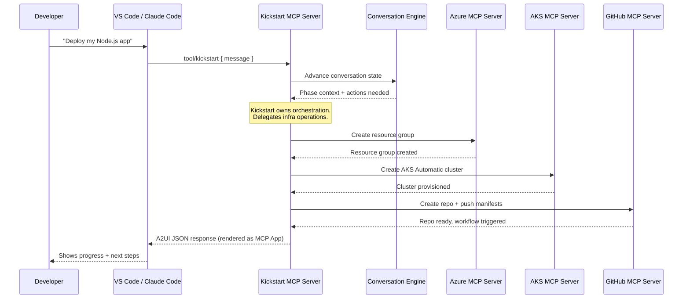
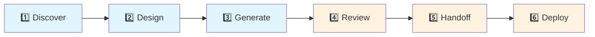
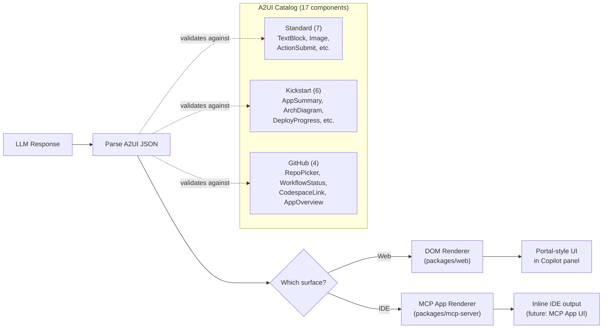
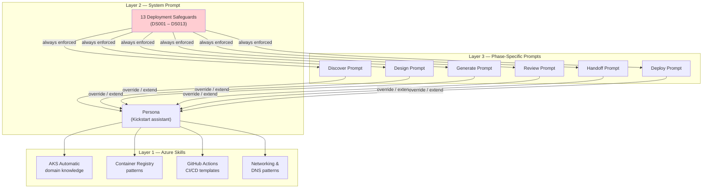
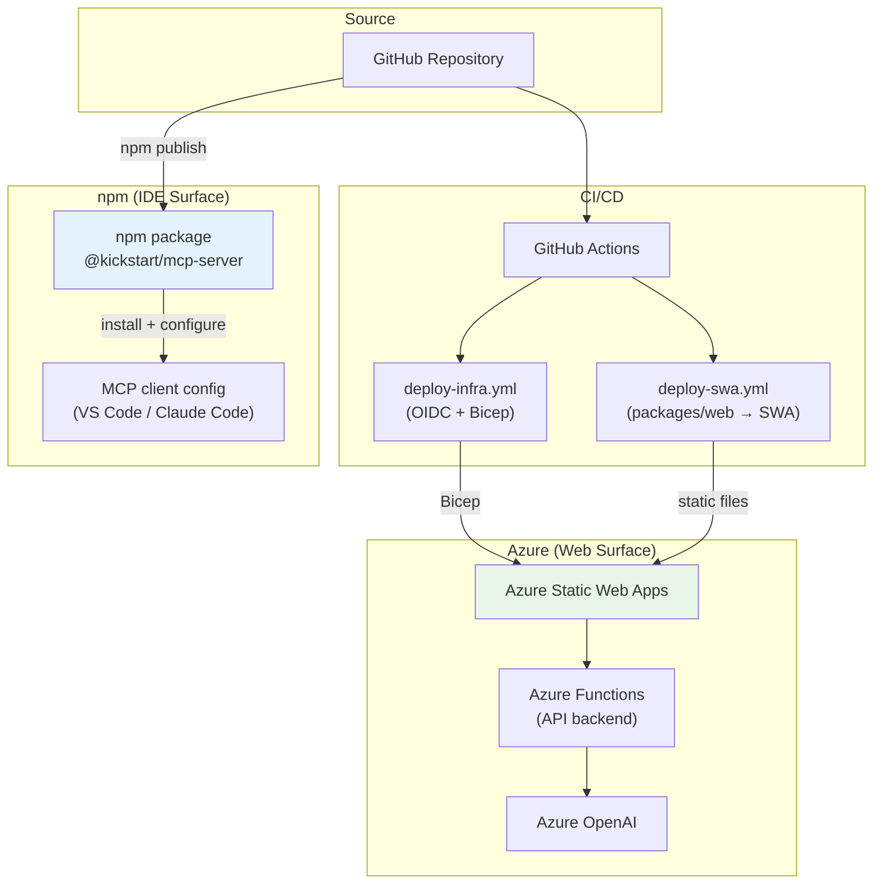

# Kickstart Architecture

This document describes the Kickstart system architecture — an AI-guided onboarding experience that helps developers deploy applications to AKS Automatic. Kickstart presents AKS as a "scalable app platform," hiding Kubernetes complexity until the Deploy phase.

## System Overview

Kickstart has two surfaces — a **web portal** and an **IDE integration** — both powered by a shared core engine.



**Key insight:** When Kickstart hosts the experience (web), it provides the LLM (Azure OpenAI). When running as an MCP server (IDE), the user's own LLM handles inference.

---

## Web Surface Flow

The web surface runs as a static site on Azure Static Web Apps with an Azure Functions backend that proxies to Azure OpenAI.



---

## IDE Surface Flow

The IDE surface exposes Kickstart as an MCP server. It delegates infrastructure operations to specialized MCP servers for Azure, AKS, and GitHub.



---

## Conversation Phases

Kickstart guides developers through 6 conversation phases. Kubernetes concepts are deliberately hidden until the Review phase — the user experience is "deploy an app," not "configure Kubernetes."



| Phase | Purpose | K8s Exposure |
|-------|---------|:---:|
| **Discover** | Understand the app — language, framework, ports, data stores | Hidden |
| **Design** | Architecture decisions — scaling, networking, storage | Hidden |
| **Generate** | Produce Dockerfiles, manifests, CI/CD pipelines | Hidden |
| **Review** | Validate generated artifacts, show K8s resources | Visible |
| **Handoff** | Push to GitHub, create PR, open Codespace | Visible |
| **Deploy** | Provision AKS Automatic, deploy workloads | Visible |

Phases 1–3 frame AKS Automatic as a "scalable app platform." Kubernetes terminology only surfaces in phases 4–6 when the developer reviews actual manifests.

---

## A2UI Rendering Pipeline

A2UI (Adaptive Application UI) is a JSON-based component schema. The LLM returns structured A2UI JSON, and each surface renders it natively.



**Catalog ID:** `https://kickstart.aks.azure.com/catalog/v1/kickstart-catalog.json`

The catalog defines 17 components across three categories:
- **Standard (7):** Basic UI primitives — text, images, actions
- **Kickstart Custom (6):** Domain-specific — architecture diagrams, deploy progress, resource summaries
- **GitHub (4):** GitHub integration — repo pickers, workflow status, Codespace links, app overview

---

## Prompt Architecture

Kickstart uses a 3-layer prompt system. Higher layers are more specific and override lower layers as needed.



**Layer composition at runtime:**
1. **Azure Skills** (Layer 1) are loaded per-phase — only relevant domain knowledge is injected
2. **System Prompt** (Layer 2) provides the Kickstart persona and enforces 13 deployment safeguards (DS001–DS013) across all phases
3. **Phase-Specific Prompts** (Layer 3) tailor the conversation for each phase's goals

The deployment safeguards (DS001–DS013) ensure generated infrastructure follows Azure best practices — things like enabling managed identity, enforcing HTTPS, setting resource limits, and using private endpoints.

---

## Deployment Architecture



| Target | Domain | Status |
|--------|--------|--------|
| Web (dev) | `kickstart.prototypes.aks.azure.sabbour.me` | Active |
| Web (production) | `kickstart.aks.azure.com` | Future |
| IDE | npm: `@kickstart/mcp-server` | In development |

---

## Monorepo Structure

```
kickstart/
├── packages/
│   ├── core/               @kickstart/core — shared engine
│   │   └── src/
│   │       ├── catalog/    A2UI component schemas (JSON Schema draft/2020-12)
│   │       ├── engine/     Conversation state machine + phase transitions
│   │       ├── generators/ Dockerfile, manifest, and CI/CD generators
│   │       ├── prompts/    3-layer prompt system
│   │       └── types.ts    Shared type contracts
│   ├── web/                @kickstart/web — portal frontend
│   │   ├── api/            Azure Functions (converse endpoint)
│   │   ├── js/             Client-side JS (config, auth, copilot panel)
│   │   ├── css/            Styles
│   │   └── index.html      Entry point
│   └── mcp-server/         @kickstart/mcp-server — IDE integration
│       └── src/
│           ├── tools/      MCP tool definitions
│           ├── a2ui.ts     A2UI response formatting
│           └── index.ts    Server entry point
├── infra/                  Bicep templates + setup scripts
├── docs/                   Architecture and documentation
└── package.json            Workspace root
```

Build order: `core` → `web/api` + `mcp-server` (core must build first due to project references).
