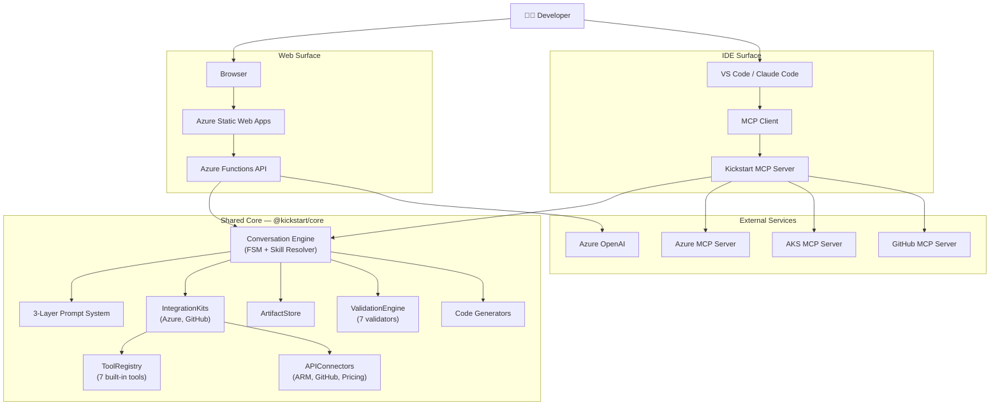
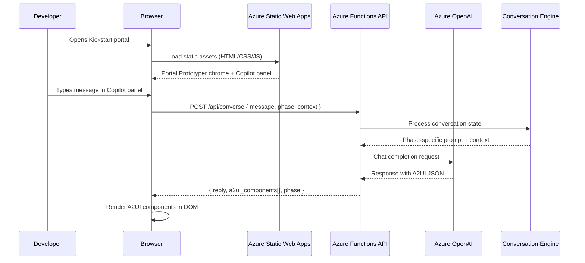
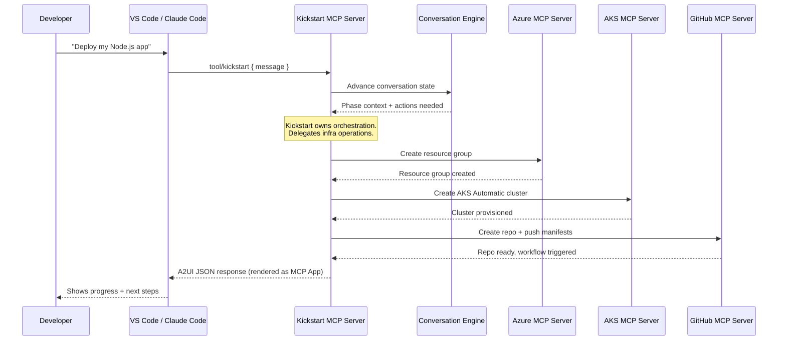
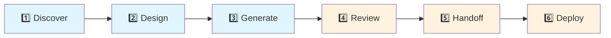
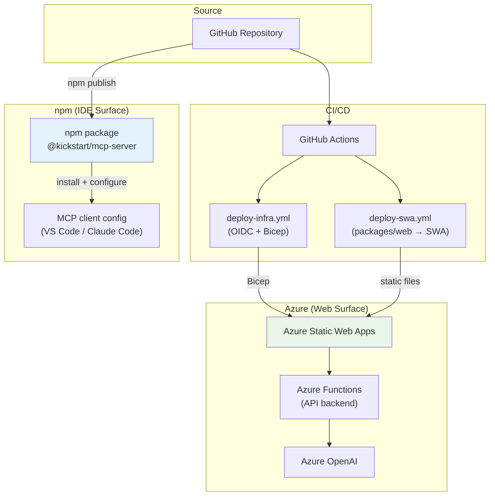

# Kickstart Architecture

This document describes the Kickstart system architecture — an AI-guided onboarding experience that helps developers deploy applications to AKS Automatic. Kickstart presents AKS as a "scalable app platform," hiding Kubernetes complexity until the Deploy phase.

## System Overview

Kickstart has two surfaces — a **web portal** and an **IDE integration** — both powered by a shared core engine.



**Key insight:** When Kickstart hosts the experience (web), it provides the LLM (Azure OpenAI). When running as an MCP server (IDE), the user's own LLM handles inference.

---

## Web Surface Flow

The web surface runs as a static site on Azure Static Web Apps with an Azure Functions backend that proxies to Azure OpenAI.



---

## IDE Surface Flow

The IDE surface exposes Kickstart as an MCP server. It delegates infrastructure operations to specialized MCP servers for Azure, AKS, and GitHub.



---

## Conversation Phases & Skill Resolver

Kickstart guides developers through 6 conversation phases. Kubernetes concepts are deliberately hidden until the Review phase — the user experience is "deploy an app," not "configure Kubernetes."



| Phase | Purpose | K8s Exposure |
|-------|---------|:---:|
| **Discover** | Understand the app — language, framework, ports, data stores | Hidden |
| **Design** | Architecture decisions — scaling, networking, storage | Hidden |
| **Generate** | Produce Dockerfiles, manifests, CI/CD pipelines | Hidden |
| **Review** | Validate generated artifacts, show K8s resources | Visible |
| **Handoff** | Push to GitHub, create PR, open Codespace | Visible |
| **Deploy** | Provision AKS Automatic, deploy workloads | Visible |

Phases 1–3 frame AKS Automatic as a "scalable app platform." Kubernetes terminology only surfaces in phases 4–6 when the developer reviews actual manifests.

### Skill Resolver

The **skill resolver** (`packages/core/src/engine/skill-resolver.ts`) is Layer 1 of the prompt system. At each phase transition, it inspects all registered `IntegrationKit`s and injects only the relevant domain knowledge into the system prompt.

Resolution priority (highest first):
1. `kit.phasePrompts[phase]` — explicit per-phase augmentations declared by the kit
2. `kit.prompts` filtered by keyword heuristics — backward-compat for kits that don't use `phasePrompts`

A synthetic tool-listing prompt is prepended at the Discover phase so the LLM knows which tools it can call proactively.

---

## IntegrationKit + APIConnector Pattern

**IntegrationKits** are the canonical extension unit for Kickstart. A kit bundles:

- **Tools** — LLM-callable functions (registered into `ToolRegistry` on `registerKit`)
- **Connectors** — Authenticated API clients (registered into `APIConnectorRegistry` on `registerKit`)
- **Prompts** — System-prompt augmentations, optionally scoped per-phase
- **Components** — A2UI component type declarations (rendered by the web layer)

Two built-in kits ship with `@kickstart/core`:

| Kit | Tools | Connectors | Components |
|-----|-------|-----------|-----------|
| `azure` | `azure_resource_list`, `azure_resource_get`, `estimate_cost` | `AzureARMConnector`, `PricingConnector` | `azureLoginCard`, `azureResourcePicker`, `azureResourceForm` |
| `github` | `github_repo_info` | `GitHubConnector` | `githubLoginCard`, `githubRepoPicker`, `githubAction`, `githubCommit` |

**APIConnectors** own the token lifecycle and HTTP plumbing. Every connector implements the same interface: `authenticate()`, `request()`, `isAuthenticated()`. The `APIConnectorRegistry` maps connector names to instances and is shared across the app.

```mermaid
flowchart LR
    Kit["IntegrationKit"] -->|register| KitReg["IntegrationKitRegistry"]
    KitReg -->|auto-wires| ToolReg["ToolRegistry"]
    KitReg -->|auto-wires| ConnReg["APIConnectorRegistry"]
    ToolReg -->|execute| Tools["azure_resource_list\nazure_resource_get\ngh_repo_info\n..."]
    ConnReg -->|request()| Connectors["AzureARMConnector\nGitHubConnector\nPricingConnector"]
```

---

## Tool System

The `ToolRegistry` is the central register for LLM-callable tools. Tools are plain objects implementing `Tool<TArgs>`:

```typescript
interface Tool<TArgs> {
  name: string;
  description: string;
  parameters: JSONSchema;
  execute(args: TArgs): Promise<unknown>;
}
```

The registry exports tools in OpenAI function-calling format via `toOpenAIFormat()` and routes `execute(name, args)` calls with structured logging.

**7 built-in tools** (auto-registered at import):

| Tool | Kit | Purpose |
|------|-----|---------|
| `azure_resource_list` | azure | List Azure resources in a subscription |
| `azure_resource_get` | azure | Inspect a specific Azure resource |
| `estimate_cost` | azure | Monthly cost estimate for a deployment plan |
| `github_repo_info` | github | Detect language, runtime, CI setup from a GitHub repo |
| `generate_kubernetes_manifest` | core | Generate K8s Deployment/Service/Ingress YAML |
| `list_artifacts` | core | List generated artifacts in the store |
| `get_artifact` | core | Retrieve a generated artifact by path |

---

## Artifact Store

The `ArtifactStore` manages generated deployment files in-memory during a session. Artifacts are produced by tools and generators, then surfaced in the Review phase for user inspection.

```typescript
interface ArtifactStore {
  put(path, content, metadata?): void;  // Create or replace
  get(path): Artifact | null;
  list(glob?): Artifact[];              // Glob filtering supported
  delete(path): void;
  export(): Record<string, string>;     // Path → content map
  clear(): void;
}
```

Artifacts carry a `language` hint (e.g. `"yaml"`, `"dockerfile"`) for syntax highlighting and optional free-form `metadata`.

---

## Validation Engine

The `ValidationEngine` runs registered validators against generated artifacts before deployment. Each validator maps to one or more deployment safeguard rules (DS001–DS013).

**7 built-in validators:**

| Validator | What it checks |
|-----------|---------------|
| `resource-limits` | Every container specifies CPU/memory requests and limits |
| `no-latest-tag` | No container image uses the `:latest` tag |
| `health-probes` | Readiness and liveness probes are configured |
| `no-privileged` | No container runs with `privileged: true` |
| `namespace-set` | A non-default namespace is explicitly set |
| `replica-count` | Deployment has ≥ 2 replicas for availability |
| `image-pull-policy` | `imagePullPolicy` is set to `Always` for mutable tags |

Validators return `{ passed, message, severity, fix? }`. Severity `"error"` blocks deployment; `"warning"` suggests improvement.

```typescript
const engine = createDefaultValidationEngine();  // all 7 pre-registered
const report = engine.validateArtifact(myArtifact);
if (report.hasErrors) { /* block deploy */ }
```

---

## A2UI Rendering Pipeline

A2UI (Agent-to-UI) v0.9 is the UI component protocol used by Kickstart. The LLM returns structured A2UI JSON; the web layer renders it natively using React 19.

---

## Prompt Architecture

Kickstart uses a 3-layer prompt system. Higher layers are more specific and override lower layers as needed.


**Layer composition at runtime:**
1. **IntegrationKit Skills** (Layer 1) are loaded per-phase by the **Skill Resolver** — only relevant domain knowledge from registered kits is injected. Kits can declare `phasePrompts` for explicit per-phase targeting, or flat `prompts` that are classified via keyword heuristics.
2. **System Prompt** (Layer 2) provides the Kickstart persona and enforces 13 deployment safeguards (DS001–DS013) across all phases
3. **Phase-Specific Prompts** (Layer 3) tailor the conversation for each phase's goals

The deployment safeguards (DS001–DS013) ensure generated infrastructure follows Azure best practices — things like enabling managed identity, enforcing HTTPS, setting resource limits, and using private endpoints.

---

## Deployment Architecture



| Target | Domain | Status |
|--------|--------|--------|
| Web (dev) | `kickstart.aks.azure.sabbour.me` | Active |
| Web (production) | `kickstart.aks.azure.com` | Future |
| IDE | npm: `@kickstart/mcp-server` | In development |

---

## Monorepo Structure

```
kickstart/
├── packages/
│   ├── core/               @kickstart/core — shared engine
│   │   └── src/
│   │       ├── artifacts/  ArtifactStore — generated file management
│   │       ├── catalog/    A2UI component schemas (JSON Schema draft/2020-12)
│   │       ├── connectors/ APIConnector implementations + registry
│   │       ├── engine/     Conversation FSM, phases, skill resolver
│   │       ├── generators/ Dockerfile, manifest, and CI/CD generators
│   │       ├── kits/       IntegrationKit definitions + registry
│   │       ├── prompts/    3-layer prompt system
│   │       ├── services/   Response processor
│   │       ├── telemetry/  Structured logger
│   │       ├── tools/      ToolRegistry + 7 built-in tools
│   │       ├── validation/ ValidationEngine + 7 validators
│   │       └── types.ts    Shared type contracts
│   ├── web/                @kickstart/web — React 19 + Vite 6 portal
│   │   ├── api/            Azure Functions API (7 endpoints)
│   │   ├── src/
│   │   │   ├── catalog/    Kickstart A2UI catalog (16 custom components)
│   │   │   ├── components/ Chat, FileEditor, Landing, Layout, Sidebar
│   │   │   ├── hooks/      useA2UI, useChat
│   │   │   ├── services/   API client, demo scenarios, virtual-fs
│   │   │   └── vendor/     Vendored A2UI v0.9 runtime
│   │   ├── css/            Stylesheets (Fluent 2, A2UI overrides)
│   │   └── public/         Static assets
│   └── mcp-server/         @kickstart/mcp-server — IDE integration
│       └── src/
│           ├── tools/      MCP tool definitions
│           ├── a2ui.ts     A2UI response formatting
│           └── index.ts    Server entry point (stdio transport)
├── infra/                  Bicep templates + setup scripts
├── docs/                   Architecture and documentation
└── package.json            Workspace root
```

Build order: `core` → `web/api` + `mcp-server` (core must build first due to project references).
