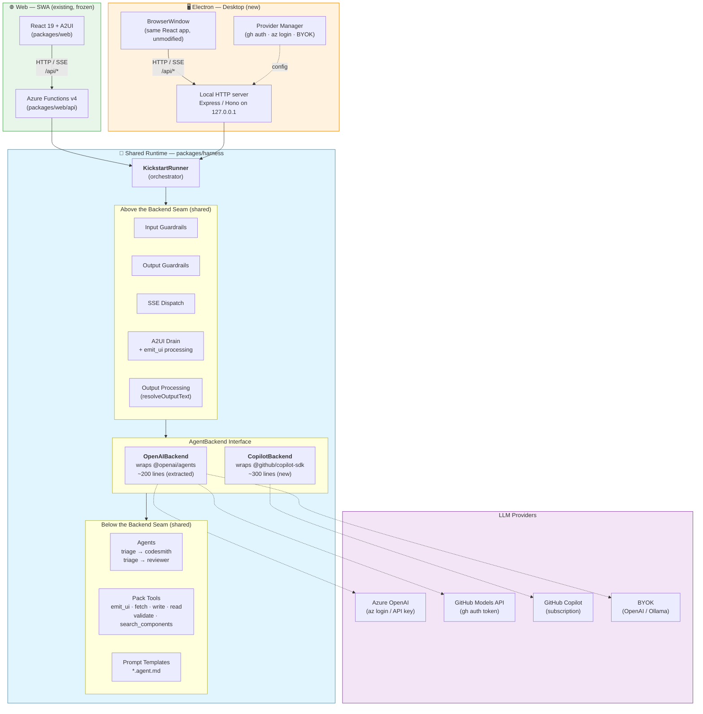
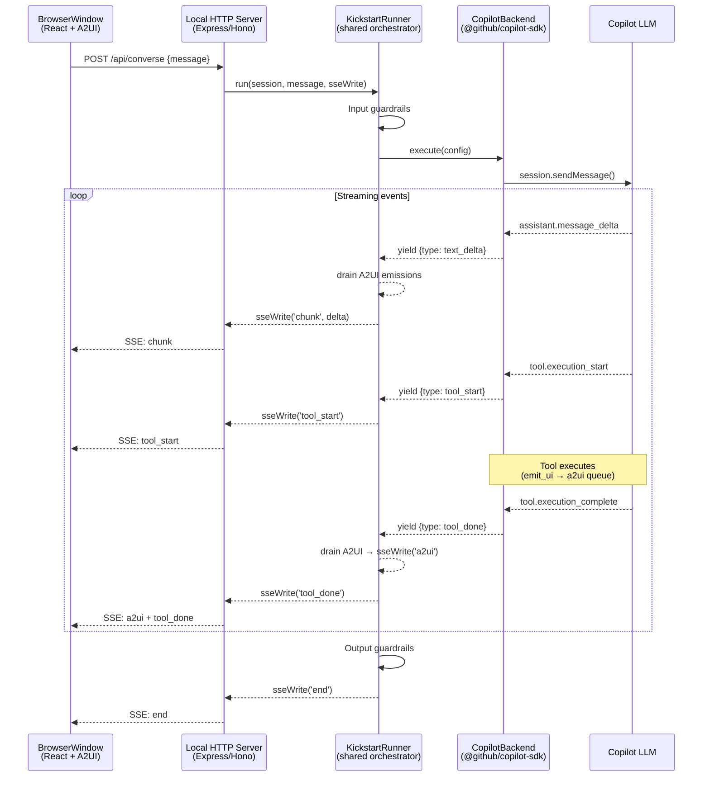

# Design Proposal: Kickstart as a Local Electron Desktop App

> **Status:** 🚧 Work in progress (rev 8). Additive deployment — SWA + Functions contract is frozen. Filed as an in-repo DP rather than a GitHub issue so edits flow through normal PR review.
>
> **Owner:** Leela (Lead) · **Co-authors:** Ahmed Sabbour (brainstorm partner)

**Author:** Leela (Lead)
**Date:** 2026-04-21
**Status:** DRAFT rev 8 — exploratory, no implementation issue filed yet
**Revised:** 2026-04-21 — rev 2: additive constraint, LLM provider matrix, auth recombination
**Revised:** 2026-04-21 — rev 3: Copilot CLI piggyback analysis, Copilot SDK discovery, provider priority rerank
**Revised:** 2026-04-21 — rev 4: `@openai/agents` + `@github/copilot-sdk` interop analysis → verdict: incompatible at model-provider level. BYOK is P0, Copilot SDK is P1 alternative runtime.
**Revised:** 2026-04-21 — rev 5: Dual-runtime strategies evaluated. Option 1 (full SDK switch for Electron) recommended at M effort. Shim rejected as premature.
**Revised:** 2026-04-21 — rev 6: Node.js SDK source validation. 8 claims verified, 2 major corrections: (1) native sub-agent support exists (handoffs NOT a gap), (2) BYOK support in SDK could unify P0/P1 into single runtime. Spike gates reduced from 4 to 2.
**Revised:** 2026-04-21 — rev 7: Option 3 (KickstartRunner shim) re-evaluated with corrected SDK facts. Verdict FLIPPED: shim now RECOMMENDED over Option 1. Leakage surface shrank from 6→2; shim pays off on day 1 since dual-runtime is the requirement, not a speculation.
**Revised:** 2026-04-22 — rev 8: Reconciled DP with current repo code (runner.ts, agents-otel-bridge.ts, converse.ts, telemetry, handler count, agent topology). Added mermaid architecture diagram for Option 3 target.
**Audience:** Ahmed Sabbour, squad

> ### Rev 8 Changelog
>
> - **Reconciled with repo:** Re-surveyed all critical source files against DP claims. Fixed minor line-reference drifts (`agents-otel-bridge.ts` 262→277, `Runner.run()` 316→319). Added substantive reconciliation notes for telemetry migration (§2, §3.5): API layer has migrated from classic `applicationinsights` SDK to pure OTel via `@azure/monitor-opentelemetry`; desktop telemetry guidance updated accordingly.
> - **Added mermaid architecture diagram:** Option 3 target architecture (§1.1) + Electron turn sequence diagram. Referenced from §18.10.

---

> ## ⚠️ Additive Constraint (rev 2)
>
> **Electron is an ADDITIVE deployment method.** The hosted SWA + Azure Functions
> path is the production deployment and MUST NOT regress.
>
> - The Azure Functions HTTP surface is **frozen as the contract.** SSE shape,
>   response envelopes, cookie names, event taxonomy — all untouched.
> - Nothing in `packages/web/api/` gets deleted. Refactors are
>   **behavior-preserving only** (extract pure handler cores; do not rewrite
>   or remove the Functions entry points).
> - The harness + packs contract (`packages/harness/`, `pack-*`) stays untouched.
> - The frontend (`packages/web/src`) stays untouched.
> - Infra (Bicep), SWA auth, SWA pipeline, App Insights, Key Vault — all unchanged.
> - Electron work lands in a **new package** (`packages/desktop/` or `apps/desktop/`)
>   and touches `packages/web/api/` **only** to extract pure handler cores via
>   refactor (never delete, never modify existing behavior).

---

## 1.1 Target Architecture — Option 3 (KickstartRunner Shim) *(rev 8)*

> Visual overview of the recommended architecture (§18.10). Two deployment fronts share one runtime through the `AgentBackend` abstraction.



**Legend:** 🟢 Green = Web-only (existing, frozen) · 🟠 Orange = Electron-only (new) · 🔵 Blue = Shared code (same in both deployments) · 🟣 Purple = External SDKs / providers

#### Electron Turn Sequence (single user message)



---

## 1. Problem Statement & Motivation

Kickstart today runs as a hosted SWA + Azure Functions app. That's fine for demos and team-shared deployments, but it means:

- **Every user needs a deployed Azure backend.** No internet, no Kickstart. Conference demos, flight-mode prototyping, air-gapped corporate networks — all out.
- **API keys live server-side.** Good for security, terrible for individual developers who already have `az login` configured and just want to point Kickstart at *their own* Azure OpenAI resource and go.
- **The MCP server already proves local-first works.** `@kickstart/mcp-server` runs the same harness on the user's machine via stdio. An Electron shell is the GUI equivalent.

**Target user:** Individual developer or small-team lead who wants Kickstart's guided AKS onboarding using their existing Azure developer identity, offline capability, and zero Azure hosting cost. Secondary: field engineers doing demos without reliable internet.

**This is a delivery vehicle, not a product pivot.** The hosted SWA version stays. Electron is a second distribution channel — same harness, same packs, different shell.

---

## 2. Current Architecture Snapshot

| Layer | Package | Runtime | Notes |
|-------|---------|---------|-------|
| Frontend | `packages/web` (React 19, Vite 6) | Browser | A2UI v0.9 component system, Fluent UI 2 |
| API | `packages/web/api` (Azure Functions v4, Node 22) | Azure Functions host | esbuild-bundled, `@azure/functions-core` virtual module |
| Harness | `packages/harness` (`@kickstart/harness`) | Node (pure TS) | Runner, session, SSE, pack registry — no Azure dependency |
| Packs | `pack-core`, `pack-azure`, `pack-aks-automatic`, `pack-github` | Node (pure TS) | Agent/skill markdown loaded from filesystem at runtime |
| MCP Server | `packages/mcp-server` | Node (stdio) | Already runs local-first — proves harness portability |
| Infra | `infra/` (Bicep) | Azure | SWA + Key Vault + App Insights + Log Analytics |
| Auth | SWA built-in auth (Entra ID) | Azure-managed | `x-ms-token-aad-access-token` header injection |
| GitHub | OAuth code flow via Functions | Server-side | `kickstart-github-session` encrypted cookie |
| Telemetry | `@azure/monitor-opentelemetry` (pure OTel) | Server-side | Connection string in env vars, secret-redacting processors |

> **Reconciliation (rev 8, 2026-04-22):** The §2 table previously listed `applicationinsights` (classic SDK) alongside `@azure/monitor-opentelemetry`. The API layer has fully migrated to pure OTel: `appinsights.ts` uses only `useAzureMonitor()` from `@azure/monitor-opentelemetry`, and the classic `applicationinsights` SDK is explicitly banned via ESLint `no-restricted-imports`. All manual telemetry (`trackException`, `trackEvent`, `trackTrace`) emits through `@opentelemetry/api` / `@opentelemetry/api-logs`. Table corrected.

**Secrets surface today:** `AZURE_OPENAI_API_KEY`, `AZURE_OPENAI_ENDPOINT`, `AZURE_CLIENT_ID/SECRET/TENANT_ID`, `OPENAI_API_KEY` (fallback), `APPLICATIONINSIGHTS_CONNECTION_STRING`, GitHub OAuth `clientId`/`clientSecret`/`sessionSecret`. All live in Azure Functions app settings or Key Vault — never shipped to the browser.

**LLM provider seam:** `buildModelProvider()` in `packages/harness/src/runtime/runner.ts:54-72` is the **single point** where the `OpenAIProvider` is constructed. It reads `AZURE_OPENAI_ENDPOINT` + `AZURE_OPENAI_API_KEY` from env, or falls back to standard OpenAI. The `@openai/agents` SDK's `OpenAIProvider` accepts `apiKey` + `baseURL` — this is the seam all Electron LLM provider options wire through.

---

## 3. Proposed Electron Architecture (rev 2 — Non-destructive)

### 3.1 Process Model

```
┌──────────────────────────────────────────────────────┐
│  Main Process (Node 22)                              │
│  ├── BrowserWindow (renderer)                        │
│  ├── Local HTTP server (Express/Hono on 127.0.0.1)  │
│  │   └── Same routes as Azure Functions (/api/*)     │
│  ├── LLM provider manager (GitHub/AOAI/BYOK)        │
│  ├── Pack registry + Runner                          │
│  └── Auto-updater                                    │
└──────────────────────────────────────────────────────┘
         │ HTTP (127.0.0.1:{ephemeral})
┌──────────────────────────────────────────────────────┐
│  Renderer Process (Chromium)                         │
│  └── UNMODIFIED Vite React app (packages/web)        │
│      └── fetch('/api/converse') → localhost proxy     │
└──────────────────────────────────────────────────────┘
```

### 3.2 Renderer: Zero Frontend Changes

The `packages/web/src` React app loads **completely unmodified** into `BrowserWindow`:

- In dev: `loadURL('http://localhost:{vite-port}')`. Vite proxy already forwards `/api/*`.
- In production: `loadFile('dist/index.html')` with the Electron main process serving `/api/*` on `127.0.0.1:{ephemeral-port}`. The renderer's `fetch('/api/...')` calls are intercepted by Electron's `protocol.handle()` or `session.webRequest` to redirect to the local server.
- **No preload IPC bridge needed for API calls.** The frontend uses standard `fetch()` to HTTP endpoints — identical to the SWA deployment. This eliminates an entire class of IPC bridge bugs.
- **CSP:** Add `connect-src 'self' http://127.0.0.1:* https://models.github.ai https://api.openai.com https://*.openai.azure.com https://api.github.com https://*.azure.com; script-src 'self'`.
- **`contextIsolation: true`** — non-negotiable. `nodeIntegration: false`.

### 3.3 API Layer — Non-destructive Architecture (rev 2)

Ahmed's directive: "Don't strip anything. SWA still works." The prior DP's recommendation to strip `@azure/functions` wrappers and shim `InvocationContext` is **rejected.** Instead:

#### Tradeoff Table

| Option | How | Frontend changes | SWA regression risk | Refactor scope in `packages/web/api/` | Testability |
|--------|-----|-----------------|--------------------|-----------------------------------------|-------------|
| **(1) Factor out handler cores only** | Each Functions handler becomes thin wrapper around pure `handleConverse(input): AsyncIterable<Event>` core. Electron calls cores directly via IPC. | **YES** — needs preload IPC bridge replacing `fetch()` | Zero — Functions wrappers untouched | Moderate — extract core from each of 20 handlers | Cores testable independently |
| **(2) Local HTTP server in Electron** | Run Express/Hono on `127.0.0.1:{ephemeral}`. Wire handler cores (or bundle Functions code with a minimal shim) to serve identical routes. Renderer uses unmodified frontend. | **ZERO** | Zero — Functions code untouched | Low to moderate — cores called from both routes | Full HTTP-level integration tests |
| **(3) Hybrid: factor cores + local HTTP** | Extract pure handler cores (option 1). Wire them to BOTH Functions entry points AND a local Express/Hono server in Electron main. | **ZERO** | Zero — Functions wrappers are thin pass-through | Moderate — extract cores, wire to Express/Hono | Best — cores unit-testable, HTTP integration-testable |

#### Recommendation: Option 3 (Hybrid)

**Rationale:**

1. **Zero frontend changes.** The renderer keeps talking to `/api/converse` over HTTP/SSE. In SWA it hits Azure Functions; in Electron it hits `127.0.0.1:{ephemeral}`. The frontend doesn't know or care. This eliminates all IPC bridge complexity from the prior DP.

2. **Behavior-preserving refactor.** Each of the 20 handlers in `packages/web/api/src/functions/` gets a mechanical refactor:
   - **Before:** `async function converse(request: HttpRequest, ctx: InvocationContext): Promise<Response> { /* 200 lines mixing HTTP parsing + business logic */ }`
   - **After:** `async function converse(request: HttpRequest, ctx: InvocationContext): Promise<Response> { return converseCore(await parseConverseRequest(request), ctx); }` — the Functions entry point becomes a 5-line wrapper. The core `converseCore()` lives in a new `packages/web/api/src/cores/` directory and has zero `@azure/functions` imports.

3. **SWA cannot regress.** The Functions entry points (`app.http("converse", ...)`) remain byte-for-byte identical in their registration. They just delegate to the extracted core. Existing integration tests pass unchanged.

4. **Electron local server is simple.** A ~100-line Express/Hono server maps `POST /api/converse` → `converseCore(parsedInput)`, `POST /api/converse/resume` → `resumeCore(parsedInput)`, etc. Same SSE response shape. Same status codes.

5. **The harness + packs are already clean.** `Runner`, `PackRegistry`, `Session` have zero Azure Functions dependencies. The MCP server proves this. Only the API layer's HTTP glue touches `@azure/functions`.

**What lands where:**

| Change | Package | Type |
|--------|---------|------|
| Extract `converseCore()`, `resumeCore()`, `healthCore()`, etc. | `packages/web/api/src/cores/` | Refactor (additive, behavior-preserving) |
| Functions handlers become thin wrappers calling cores | `packages/web/api/src/functions/` | Refactor (minimal diff, same behavior) |
| Express/Hono local HTTP server | `packages/desktop/src/server.ts` | New file |
| Electron main process (BrowserWindow, server lifecycle, LLM provider) | `packages/desktop/src/main.ts` | New file |
| LLM provider manager (GitHub Models, AOAI/AAD, BYOK) | `packages/desktop/src/providers/` | New files |
| Build config (electron-builder) | `packages/desktop/` | New package |

**Logger abstraction:** The cores need a logger interface that doesn't depend on `InvocationContext`. Extract a `KickstartLogger` interface in `packages/web/api/src/lib/logger.ts`. The Functions wrapper passes the existing `InvocationContext`-backed logger. The Electron server passes a `console`/file-based logger. This is the only non-trivial abstraction.

### 3.4 Harness + Packs in Electron

Unchanged from prior DP. The harness is already environment-agnostic. The MCP server proves this.

- **Pack loading:** Packs remain file-based. esbuild copy step targets Electron `resources/`.
- **Sandboxing:** Packs run in the main process (same trust level as the app).
- **The harness + packs contract is frozen.** No Electron-specific changes to `packages/harness/` or any `pack-*`.

### 3.5 Telemetry

| Concern | Desktop approach |
|---------|-----------------|
| App Insights | Optional. Phase 1: use `@azure/monitor-opentelemetry` (pure OTel) with user consent toggle. |
| User consent | First-run wizard: "Help improve Kickstart by sending anonymous usage data?" Default OFF. |
| Anonymous IDs | Random UUID on first launch, stored in app config. No PII. |
| Offline buffering | OTel SDK + Azure Monitor exporter supports disk-based retry. |
| Crash reports | Phase 1: Electron `crashReporter` module. |

> **Reconciliation (rev 8, 2026-04-22):** §3.5 previously referenced the classic `applicationinsights` SDK for desktop telemetry. The server-side API layer (`appinsights.ts`) has fully migrated to pure OTel via `@azure/monitor-opentelemetry`, and the classic SDK is banned by ESLint. Desktop should follow the same OTel-first approach: use `@azure/monitor-opentelemetry` with `useAzureMonitor()` and inject the `APPLICATIONINSIGHTS_CONNECTION_STRING` only when the user opts in. This aligns the desktop telemetry stack with the existing server-side implementation. Table entries updated.

### 3.6 Auto-Update

Use **`electron-updater`** (part of `electron-builder`). Strategy:

- Update feed: GitHub Releases (signed `.yml` manifest + platform binaries).
- Check frequency: on launch + every 4 hours.
- User prompt: notification bar, not forced restart.
- Channels: `stable` (default), `beta` (opt-in via settings).
- Differential updates (`blockmap`) to minimize download size.

---

## 4. LLM Provider Matrix (rev 2 — new section)

### 4.1 The Single Seam

`buildModelProvider()` in `packages/harness/src/runtime/runner.ts:54-72` constructs an `OpenAIProvider` and sets it as the default via `setDefaultModelProvider()`. The `OpenAIProvider` from `@openai/agents` wraps the OpenAI SDK client — it accepts `apiKey`, `baseURL`, and `useResponses`. **Every LLM provider option below wires through this single seam by varying `apiKey` and `baseURL`.**

For Electron, `buildModelProvider()` must become injectable — the Electron main process provides the `OpenAIProvider` configuration based on the user's chosen provider, rather than reading `process.env`.

### 4.2 Candidate Matrix

| | **(a) GitHub Models API** | **(b) BYOK OpenAI** | **(c) BYOK Azure OpenAI (AAD)** | **(d) BYOK Azure OpenAI (API key)** | **(e) Ollama / local** |
|---|---|---|---|---|---|
| **Auth mechanism** | GitHub PAT via `gh auth token`. Token passed as `apiKey` in `Authorization: Bearer <token>` header. | User-provided OpenAI API key, stored in OS keychain via `safeStorage`. | `DefaultAzureCredential` → `getBearerTokenProvider("https://cognitiveservices.azure.com/.default")`. Token auto-refreshed by MSAL. No key stored. | User-provided AOAI API key + endpoint, stored in OS keychain via `safeStorage`. | No auth (localhost). |
| **SDK compatibility** | ✅ **Direct.** `OpenAIProvider({ apiKey: ghToken, baseURL: "https://models.github.ai/inference", useResponses: false })`. GitHub Models API is OpenAI-compatible — same `/chat/completions` shape. `@openai/agents` works by swapping `baseURL` + `apiKey`. | ✅ **Native.** `OpenAIProvider({ useResponses: false })` reads `OPENAI_API_KEY` from env. This is the SDK's default path. | ⚠️ **Needs adapter.** `OpenAIProvider` accepts `apiKey` (string), not a token provider. Must acquire a bearer token from `DefaultAzureCredential`, pass it as `apiKey`, and handle token refresh before expiry (~1h). The `@openai/agents` SDK does not natively support `azureADTokenProvider` — we wrap it. `baseURL` is `{endpoint}/openai/v1`. | ✅ **Direct.** Identical to current SWA path: `OpenAIProvider({ apiKey, baseURL: buildAzureBaseUrl(endpoint), useResponses: false })`. This is what `buildModelProvider()` does today. | ⚠️ **Needs model mapping.** Ollama serves OpenAI-compatible API on `http://localhost:11434/v1`. `OpenAIProvider({ apiKey: "ollama", baseURL: "http://localhost:11434/v1", useResponses: false })`. Model names differ (e.g., `llama3.1` not `gpt-4o`). Requires model name mapping in `resolveModelName()`. |
| **Cost model** | **Free tier:** Every GitHub account gets daily token quota per model (varies by model tier). **Paid tier:** Pay-as-you-go via GitHub billing (metered). Copilot subscription does **not** increase Models API quota — they're billed separately. | User pays OpenAI directly. Standard pay-per-token pricing. | User pays their own Azure bill. AOAI pricing per deployment. | Same as (c) — user's Azure bill. | Free (user's hardware). |
| **Rate limits / model availability** | Free tier: token-limited per model per user per day (enforced as `UserByModelByDay`). Models available: GPT-4o, GPT-4.1, GPT-4o-mini, o3-mini, DeepSeek-R1, Llama, Mistral, and more — full catalog at `/catalog/models`. Rate limits vary by model tier (`high`, `standard`). Paid tier lifts limits. **⚠️ Uncertainty:** Rate limits may be too tight for multi-turn agentic flows (many tool calls = many completions per conversation). Phase 0 spike must measure. | Full model catalog (GPT-4o, GPT-4.1, o3, etc.). Rate limits per OpenAI tier (free/tier-1 through tier-5). Generous for paid users. | Whatever models the user has deployed. Full control. No external rate limits — only AOAI TPM/RPM quotas on the deployment. | Same as (c). | Model quality limited to what runs locally. No reasoning models. Context windows smaller. |
| **Threat surface** | `gh auth token` output is a short-lived OAuth token (~8h, refreshable). Stored in `gh` CLI's own credential store (OS keychain). Kickstart reads it at runtime, holds in-memory only. If user revokes `gh auth`, Kickstart loses access immediately. | API key is long-lived. Stored in OS keychain via `safeStorage`. Compromise of keychain = key compromise. User must manually rotate. | **Zero secrets stored by app.** Tokens are short-lived (~1h), auto-refreshed, managed by `az` CLI's MSAL cache. Strictly better than BYOK. | API key is long-lived. Same threat as (b) — keychain storage, manual rotation. | No secrets. No external calls. Minimal threat. |
| **UX friction at first run** | **Lowest.** Most Kickstart users already have `gh` CLI authenticated. One command to verify: `gh auth status`. Zero config if already authed. | Medium. User must find their API key in OpenAI dashboard, paste into settings. | Medium-high. User must have `az` CLI installed + `az login` + AOAI resource + RBAC assignment (`Cognitive Services OpenAI User`). Multi-step. | Medium. User needs AOAI endpoint URL + API key from Azure portal. | High. User must install Ollama, pull a model, ensure it's running. |

### 4.3 GitHub Models API — What We Know and What's Uncertain

**Confirmed (from public docs and research):**
- Endpoint: `https://models.github.ai/inference` (OpenAI-compatible `/chat/completions`)
- Auth: `Authorization: Bearer <github_token>` (PAT or OAuth token from `gh auth token`)
- SDK compatibility: OpenAI SDK works by setting `baseURL` to `https://models.github.ai/inference` and `apiKey` to the GitHub token
- Models: Extensive catalog including GPT-4o, GPT-4.1, GPT-4o-mini, o3-mini, DeepSeek, Llama, Mistral
- Rate limits: Token-based per model per user per day; free tier for all GitHub accounts; paid metered tier available
- Status: Public preview (GA timing unclear)

**Uncertain / Requires Phase 0 spike:**
1. **Rate limit adequacy for agentic flows.** A single Kickstart conversation may trigger 5–15 LLM completions (tool calls, retries, multi-agent handoffs). Free-tier limits may be exhausted within a few conversations. **Must measure empirically.**
2. **`useResponses: false` compatibility.** We use chat completions mode (`useResponses: false`) in `@openai/agents`. GitHub Models should support this, but needs verification.
3. **Streaming support.** SSE streaming is critical for Kickstart's UX. GitHub Models docs indicate streaming is supported, but latency characteristics for agentic patterns (many short completions) are unknown.
4. **Token scope requirements.** Does the `gh auth` token need specific scopes for Models API access? Or is any authenticated GitHub session sufficient?
5. **Copilot subscription vs. Models free tier.** These are separate. A Copilot subscriber doesn't automatically get higher Models API limits. Users on the free tier may need to upgrade to paid metered billing for production use.

**Recommendation:** Phase 0 includes a spike to validate points 1–4 with a real `gh auth token` against `models.github.ai`. If free-tier rate limits are insufficient for agentic flows, we document that paid tier is recommended and fall back to BYOK paths.

### 4.4 Priority Order — Phase 0/1 Shipping Sequence

| Priority | Provider | Phase | Rationale |
|----------|----------|-------|-----------|
| **P0** | **(a) GitHub Models API** | Phase 0 (spike) → Phase 1 (ship) | Zero-config for most users — they already have `gh auth`. Lowest UX friction. Directly validates the `@openai/agents` + GitHub Models integration. If rate limits are a problem, we know immediately. |
| **P1** | **(c) BYOK Azure OpenAI (AAD)** | Phase 0 (validate) → Phase 1 (ship) | Strongest security posture (no stored secrets). Preferred for users with AOAI resources. The `DefaultAzureCredential` path from rev 1 stays — it's repositioned as the strong secondary, not replaced. |
| **P2** | **(d) BYOK Azure OpenAI (API key)** | Phase 1 | For users who have an AOAI key but can't/won't `az login`. Direct path, mirrors current SWA behavior. |
| **P3** | **(b) BYOK OpenAI** | Phase 1 | For users without Azure at all. Standard OpenAI key in keychain. |
| **P4** | **(e) Ollama / local** | Phase 2+ | Far-future. Mention in docs as "community-supported path" since the `baseURL` swap is trivial. Don't invest in model mapping or quality testing yet. |

### 4.5 Provider Manager Design

```typescript
// packages/desktop/src/providers/provider-manager.ts
interface LLMProviderConfig {
  type: 'github-models' | 'azure-openai-aad' | 'azure-openai-key' | 'openai' | 'ollama';
  baseURL: string;
  getApiKey: () => Promise<string>;  // may refresh tokens
  modelMapping?: Record<string, string>;
}

function buildElectronModelProvider(config: LLMProviderConfig): OpenAIProvider {
  return new OpenAIProvider({
    apiKey: await config.getApiKey(),
    baseURL: config.baseURL,
    useResponses: false,
  });
}
```

For AAD token auth (provider c), `getApiKey()` acquires a bearer token from `DefaultAzureCredential` and returns it. Token refresh happens transparently via MSAL. The `OpenAIProvider` receives a fresh token per `buildModelProvider()` call — since `getSdkRunner()` lazily initializes once, we need a wrapper that refreshes the underlying client's auth header before each `runner.run()` call. **This is the only non-trivial adapter.**

---

## 5. Authentication & Secrets (rev 2 — Three-path wizard)

### 5.1 Core Principle: Piggyback on Existing CLI Sessions

The user already authenticates to GitHub (`gh auth login`) and Azure (`az login`) as part of their daily workflow. Kickstart Desktop piggybacks on those sessions. The three-path priority:

1. **GitHub Copilot/Models** (via `gh auth`) — primary, zero-config for most users
2. **Azure OpenAI via AAD** (via `az login` → `DefaultAzureCredential`) — strong secondary
3. **BYOK keys** (stored in OS keychain) — fallback

### 5.2 What Auth Does Kickstart Need?

| Capability | SWA (unchanged) | Electron — GitHub Models path | Electron — AOAI/AAD path | Electron — BYOK path |
|------------|-----------------|------------------------------|--------------------------|----------------------|
| **LLM calls** | API key in env var | GitHub token from `gh auth token` → `baseURL: models.github.ai/inference` | AAD bearer token via `DefaultAzureCredential` → AOAI endpoint `/openai/v1` | API key in keychain → OpenAI/AOAI endpoint |
| **Azure management plane** | Service principal | N/A (GitHub Models doesn't need Azure) — but if user wants AKS deploy, `az login` still needed | `DefaultAzureCredential` — inherits `az login` | `DefaultAzureCredential` if available; else limited to non-Azure tools |
| **GitHub** (repos, PRs, issues) | Server-side OAuth | `gh auth` CLI token reuse (same token used for both LLM and GitHub APIs) | `gh auth` CLI token reuse (separate from Azure auth) | `gh auth` CLI or device flow |

### 5.3 First-Run Wizard (Three-Path Detection)

```
┌─────────────────────────────────────────────────────┐
│                 Welcome to Kickstart                 │
│                                                      │
│  Detecting your developer environment...             │
│                                                      │
│  ✅ GitHub CLI: authenticated (user: @sabbour)       │
│     → GitHub Models API available                    │
│                                                      │
│  ✅ Azure CLI: authenticated (tenant: contoso.com)   │
│     → Azure OpenAI available (if configured)         │
│                                                      │
│  LLM Provider: [GitHub Models ▼]                     │
│                                                      │
│  [Continue →]                                        │
└─────────────────────────────────────────────────────┘
```

**Step 1 — Detect `gh auth status`.**
- If authenticated AND GitHub Models API responds to a test completion → offer GitHub Models as default. Done — zero additional config needed.
- The `gh auth token` output provides the bearer token. Validate with a single test completion to `models.github.ai/inference`.

**Step 2 — Detect `az login` (parallel with step 1).**
- If authenticated → prompt for AOAI endpoint URL (or detect from `az cognitiveservices account list` if available). Validate with a test token request + API call.
- Show as alternative to GitHub Models: "You can also use your Azure OpenAI resource."

**Step 3 — BYOK fallback.**
- If neither CLI is authenticated, or user explicitly chooses "Use API key" → BYOK wizard.
- Provider picker: OpenAI / Azure OpenAI (key-based).
- Key stored in OS keychain via `safeStorage.encryptString()`.
- **Fallback (Linux headless / no keyring):** Refuse to persist. Require re-entry each session. NEVER fall back to plaintext.

**Step 4 — GitHub pack auth (separate from LLM).**
- For GitHub pack features (repo creation, PRs, issue management), still prefer `gh auth` reuse.
- If user chose GitHub Models for LLM, the same `gh auth` token covers both LLM and GitHub pack APIs. Single auth, dual purpose.
- If user chose AOAI/BYOK for LLM but still wants GitHub features → detect `gh auth` separately.

### 5.4 `DefaultAzureCredential` Chain (unchanged from rev 1)

| Priority | Credential | How it activates | Notes |
|----------|-----------|-----------------|-------|
| 1 | `EnvironmentCredential` | `AZURE_CLIENT_ID` etc. set | Power-user escape hatch |
| 2 | `AzureDeveloperCliCredential` | User ran `azd auth login` | Common for `azd` users |
| 3 | `AzureCliCredential` | User ran `az login` | **Primary AOAI path** |
| 4 | `VisualStudioCodeCredential` | Azure Account VS Code ext | VS Code workflows |

### 5.5 Threat Model

| Concern | GitHub Models path | AOAI/AAD path | BYOK path |
|---------|-------------------|---------------|-----------|
| **Secrets on disk** | None by app. `gh` manages its own keychain/config. | None by app. `az` manages MSAL cache. | API key in OS keychain via `safeStorage`. |
| **Token lifetime** | `gh` OAuth token (~8h, auto-refresh). | AAD token (~1h, MSAL auto-refresh). | Key is permanent until user rotates. |
| **Revocation** | `gh auth logout` → immediate. | `az logout` → immediate. | User must delete key from settings. |
| **Cloud sync leak** | Non-issue — app stores only provider selection + endpoint URLs. | Non-issue. | Key is in OS keychain, not in app config files. |
| **Blast radius** | GitHub token scopes limit exposure. Models API access only. | Azure identity scopes. AOAI access only if RBAC assigned. | Full API key access to the provider. |

### 5.6 CSP / Network Egress (updated for GitHub Models)

```
connect-src 'self'
  http://127.0.0.1:*
  https://models.github.ai
  https://*.openai.azure.com
  https://api.openai.com
  https://login.microsoftonline.com
  https://management.azure.com
  https://api.github.com
  https://github.com
  https://*.applicationinsights.azure.com
```

---

## 6. Packaging & Distribution

| Concern | Decision |
|---------|----------|
| **Build tool** | `electron-builder` (more mature, better auto-update support than electron-forge) |
| **macOS** | Universal binary (x64 + arm64). Apple notarization via `notarize` plugin. DMG + ZIP. |
| **Windows** | NSIS installer (lighter than MSI, supports per-user install). Azure Trusted Signing or standard Authenticode. |
| **Linux** | AppImage (single file, no root) + `.deb` (Debian/Ubuntu). Phase 2. |
| **Code signing** | Required for Phase 1. macOS: Apple Developer ID. Windows: Authenticode or Azure Trusted Signing. |
| **Install size** | Estimate ~150–180 MB (Electron ~120 MB + app bundle ~30 MB + node_modules delta). |
| **Auto-update** | `electron-updater` with GitHub Releases as feed. Blockmap differential updates. |

---

## 7. Pack Boundaries Impact

**This is a delivery vehicle, not a new pack.** No `pack-electron`.

The harness + packs model is preserved:
- Packs ship bundled inside the Electron app (same as they're bundled into the Functions dist today).
- The `PackRegistry` and `Runner` are instantiated in Electron's main process, identical to how `packages/mcp-server` does it today.
- Pack boundaries remain sacred — no pack gains Electron-specific APIs.

**What needs abstracting (in `packages/web/api/` only, behavior-preserving):**

| Current assumption | Where | Abstraction |
|-------------------|-------|-------------|
| `InvocationContext` in Logger | `src/lib/logger.ts` | Extract `KickstartLogger` interface; Functions impl wraps `InvocationContext`, Electron impl wraps `console`/file |
| Handler bodies mixed with HTTP parsing | `src/functions/*.ts` (20 handlers) | Extract pure cores to `src/cores/`. Functions entry points become thin wrappers. |
| `process.env` for LLM credentials | `runner.ts:54-72` (`buildModelProvider`) | Make provider injectable. Electron passes provider from provider manager. |

None of these break the harness or packs — they're all in the API layer's host-specific glue.

---

## 8. Scope Phasing (rev 2)

### Phase 0 — Proof of Concept (estimate: M)

**Two validation tracks (can be parallel):**

**Track A — Handler Core Extraction:**
- Extract `converseCore()` and `resumeCore()` from their Functions handlers.
- Wire them to a minimal Express/Hono server.
- Wrap in Electron shell with `BrowserWindow` loading the existing Vite-built frontend.
- Verify: the full converse SSE flow works end-to-end through the local HTTP server.
- Verify: the existing SWA/Functions deployment path is unaffected (run existing integration tests).

**Track B — GitHub Models API Spike:**
- Construct an `OpenAIProvider` with `baseURL: "https://models.github.ai/inference"` and `apiKey` from `gh auth token`.
- Run a multi-turn agentic flow (≥5 tool calls) against the Kickstart harness.
- Measure: rate limit headroom on free tier, streaming latency, model availability (GPT-4o, GPT-4.1).
- Measure: `useResponses: false` compatibility.
- Document: if free tier is insufficient, what does the paid tier cost for typical usage?

**Phase 0 Definition of Done:**
1. ✅ Handler core extraction doesn't regress the hosted SWA/Functions path (existing tests pass).
2. ✅ GitHub Models API works with `@openai/agents` SDK (`OpenAIProvider` + `baseURL` swap).
3. ✅ Electron window renders the Kickstart chat UI and completes a full converse flow via local HTTP server.
4. ✅ At least one LLM provider (GitHub Models OR AOAI/AAD) authenticated and working.
5. ✅ Rate limit assessment for GitHub Models free tier documented.

### Phase 1 — MVP (estimate: L)

- All five LLM providers wired (GitHub Models, AOAI/AAD, AOAI-key, OpenAI, Ollama stub).
- First-run wizard with three-path detection (§5.3).
- Code signing (macOS notarization + Windows Authenticode).
- `electron-updater` with GitHub Releases.
- Settings UI: provider switching, endpoint management, BYOK key management.
- GitHub integration: `gh auth` CLI reuse + device flow fallback.
- App Insights telemetry with consent toggle.
- `contextIsolation` + CSP hardened.
- Windows (NSIS) + macOS (DMG) distribution.
- Extract remaining handler cores (beyond converse/resume from Phase 0).

### Phase 2 — Hardening (estimate: XL, split into sub-issues)

- Multi-tenant support: per-tenant provider config.
- Linux support (AppImage + deb).
- Offline pack discovery (local pack catalog when offline).
- `azd` integration (detect `azd auth login`, use `AzureDeveloperCliCredential`).
- Ollama model mapping + quality baseline testing.
- Differential auto-updates (blockmap).

---

## 9. Risks & Open Questions (rev 2)

| Risk / Question | Impact | Mitigation |
|----------------|--------|------------|
| **GitHub Models rate limits for agentic flows** | Free tier may be exhausted in 2–3 conversations. **See §13.3 for quota comparison with Copilot SDK — base models unlimited on paid plans via SDK.** | Phase 0 spike measures this. Copilot SDK (§13) is the primary mitigation. Document paid tier as recommended for Models API path. Fall back to BYOK. |
| **GitHub Models API stability** | Public preview — endpoint or auth may change. | Abstract behind provider manager. Changes are isolated to one module. |
| **`@openai/agents` + GitHub Models token refresh** | `OpenAIProvider` takes a static `apiKey`. `gh` tokens are long-lived (~8h) so less urgent than AAD (~1h). | For GitHub: refresh on 401. For AAD: proactive refresh before TTL. Provider manager handles both. |
| **Handler core extraction scope** | 20 handlers to extract. Risk of subtle behavior changes. | Mechanical refactor pattern. Each handler gets its own PR. Existing tests validate. Start with converse + resume in Phase 0. |
| **Licensing of `@openai/agents`** | MIT-licensed. Low risk. | Audit before Phase 1 release. |
| **Tenancy** | `DefaultAzureCredential` resolves single tenant from `az login`. | Phase 0: single tenant. Phase 1: tenant picker. Phase 2: multi-tenant. |
| **AOAI RBAC requirement** | User needs `Cognitive Services OpenAI User` role. | First-run wizard validates with test call. Clear 403 error message. |
| **Local HTTP server port conflicts** | Ephemeral port `127.0.0.1:0` may conflict with other local servers. | Use `server.listen(0)` for OS-assigned port. Pass port to renderer via Electron protocol handler. |
| **`InvocationContext` coupling depth** | Known: `logger.ts`. Unknown: deeper assumptions? | Phase 0 audit. So far only `logger.ts` and handler function signatures use it directly. |

---

## 10. Estimate (rev 2)

| Phase | Scope | T-shirt | Notes |
|-------|-------|---------|-------|
| Phase 0 | PoC: handler core extraction + Electron shell + local HTTP server + GitHub Models spike | **M** | ~1 sprint. Two parallel tracks. |
| Phase 1 | MVP: all providers, first-run wizard, signing, updater, settings, remaining core extractions | **L** | ~3 sprints. Code signing setup is the long pole. |
| Phase 2 | Hardening: multi-tenant, Linux, offline, Ollama, `azd` | **XL** | Split per XL-split rule. ~6+ sprints. |

---

## 11. Docs Impact

| Document | Change |
|----------|--------|
| `docs-site/docs/architecture/overview.md` | Add "Delivery Vehicles" section: SWA (hosted) vs. Electron (desktop) vs. MCP (IDE). |
| New: `docs-site/docs/guides/desktop/` | Getting started, LLM provider setup (GitHub Models / AOAI / BYOK), troubleshooting. |
| `DEVELOPMENT.md` | Add Electron dev loop: `npm run dev:electron`, `npm run build:electron`. |
| `README.md` | Add "Download Desktop App" section with installer links. |
| `docs-site/docs/getting-started/environment-variables.md` | Document which vars apply to desktop vs. hosted. |

---

## 12. Recommendation (rev 2)

**Prototype Phase 0 first. Don't file implementation issues yet.**

Rationale (updated):
1. **Two riskiest assumptions must be validated together:** (a) handler core extraction doesn't regress SWA, and (b) GitHub Models API works with `@openai/agents`. Phase 0 proves both in ~1 sprint.
2. The handler core extraction is the one touch point in existing code. It must be behavior-preserving and it must pass all existing tests. Until we prove this is mechanical (not surgical), don't commit to a Phase 1 timeline.
3. GitHub Models rate limits for agentic flows are genuinely unknown. If the free tier can't support a 5-turn conversation, we need to know before promising "zero-config" to users.
4. Filing issues before the PoC creates planning debt if we discover a blocking problem.

**Concrete next step:** One developer (Fry or Bender) spends one sprint on Phase 0. Two parallel tracks:
- **Track A:** Extract `converseCore()` + `resumeCore()`, wire to Express server in Electron shell, verify SWA tests still pass.
- **Track B:** Build a 50-line script that runs `@openai/agents` with `OpenAIProvider({ baseURL: "https://models.github.ai/inference", apiKey: ghToken })` through a multi-turn harness flow. Measure rate limits, latency, streaming.

If both tracks succeed, file Phase 1 issues. If either fails, we know exactly what's blocking.

Working beats perfect. Ship the PoC, then decide.

---

## 13. Copilot CLI Piggyback Analysis (rev 3 — 2026-04-21)

> **Context:** Ahmed asked whether we can piggyback on the GitHub Copilot CLI
> itself as the LLM backend — shell out to it as a subprocess, reuse its token,
> or otherwise leverage the Copilot subscription the user is already paying for.
>
> **Why this matters:** The P0 GitHub Models API path (§4) has a critical
> rate-limit problem. Free-tier daily caps (~50–150 req/day depending on model)
> will be exhausted in 3–10 multi-turn Kickstart conversations. The Copilot
> premium-request pool is a **separate billing SKU** with much more generous
> limits: base models (GPT-4o, GPT-4.1) are **unlimited** on paid Copilot plans
> (Pro $10/mo, Business $19/user/mo). Premium models consume from a monthly
> allowance (300–1500 depending on plan) with $0.04/request overage. This is
> strictly better than the Models API free tier for agentic workloads.

### 13.1 Option Enumeration

#### (a) Shell out to `gh copilot suggest` / `gh copilot explain`

The older `gh copilot` extension (distinct from the new Copilot CLI binary).

| Criterion | Assessment |
|-----------|------------|
| **Feasibility** | ⚠️ Commands exist but produce human-readable terminal output only. No structured JSON. No streaming. No tool-call support. The `suggest` command is limited to shell/git/general suggestions — not arbitrary chat completions. |
| **Legal/ToS** | ✅ Official GitHub product, used as intended. |
| **Quota** | Uses Copilot premium requests (separate from Models API). |
| **UX** | Requires `gh` CLI + `gh copilot` extension installed. |
| **`@openai/agents` compat** | ❌ Not OpenAI-compatible. No `/chat/completions` shape. Would need a bespoke adapter that parses terminal output — fragile and lossy. |
| **Tool calling** | ❌ None. |

**Verdict: NOT VIABLE.** The `gh copilot` extension is a terminal UX tool, not a programmatic API. No tool calling, no streaming, no structured output. Dead end for agentic flows.

#### (b) Shell out to Copilot CLI v1.x (this product — `copilot` binary)

Run the new Copilot CLI (`copilot`) as a headless subprocess and parse its output.

| Criterion | Assessment |
|-----------|------------|
| **Feasibility** | ⚠️ The Copilot CLI is a TUI (terminal user interface) application. It expects an interactive TTY. No documented `--headless` or `--json` mode for programmatic use. You could pipe prompts via stdin, but the output is rich terminal formatting (ANSI codes, progress spinners, diff views) — not structured data. |
| **Legal/ToS** | ✅ Official product, but using it as a subprocess backend is outside its designed use. Not explicitly prohibited, but fragile. |
| **Quota** | Uses Copilot premium requests. |
| **UX** | Requires `copilot` binary installed + authenticated. |
| **`@openai/agents` compat** | ❌ No OpenAI-compatible output format. Would need a complex adapter to parse TUI output into chat completion objects. |
| **Tool calling** | ❌ The CLI has its own tool system (bash, edit, view, grep) but exposes no API for external callers to inject custom tools or receive structured tool-call events. |

**Verdict: NOT VIABLE.** Shelling out to an interactive TUI and screen-scraping is brittle engineering. The CLI's tool system is internal — we can't inject Kickstart pack tools into it.

#### (c) Reuse Copilot CLI's OAuth token from its config directory

Read the Copilot session token from `~/.config/github-copilot/hosts.json` (or `~/.copilot/` for the new CLI) and use it to authenticate against Copilot's internal API.

| Criterion | Assessment |
|-----------|------------|
| **Feasibility** | ⚠️ Technically possible — the token is a file on disk. But the token format is a Copilot-specific session token, not a standard GitHub PAT. It may require token exchange with `api.github.com/copilot_internal/v2/token` to get a short-lived API token. This flow is undocumented and subject to change without notice. |
| **Legal/ToS** | 🔴 **HIGH RISK.** GitHub's ToS explicitly prohibit unauthorized third-party clients hitting `api.githubcopilot.com`. Reading another product's credential store to impersonate it is the textbook definition of unauthorized access. Account suspension risk. |
| **Quota** | Would use Copilot premium requests (same pool as the CLI). |
| **UX** | User must have Copilot CLI installed + authenticated. |
| **`@openai/agents` compat** | ⚠️ Unknown. The `api.githubcopilot.com/chat/completions` endpoint may be OpenAI-shaped, but it's internal and may have proprietary extensions or different schema. |
| **Tool calling** | ⚠️ Needs verification — the internal endpoint may support tool calling for Copilot's own agents, but the schema is undocumented. |

**Verdict: REJECTED.** ToS violation. We are not building a product that steals tokens from another product's credential store. Full stop.

#### (d) Direct `api.githubcopilot.com/chat/completions` with Copilot token

Hit GitHub's internal Copilot completions endpoint directly, obtaining a token through any means (PAT, OAuth, token exchange).

| Criterion | Assessment |
|-----------|------------|
| **Feasibility** | The endpoint exists and serves OpenAI-shaped responses (based on community reverse-engineering). But it's an internal, undocumented API. No stability guarantees. No versioning contract. |
| **Legal/ToS** | 🔴 **HIGH RISK.** Same as (c). `api.githubcopilot.com` is not a public API. Using it from a non-GitHub client is explicitly against the Copilot ToS. Community projects that do this have received takedown notices. |
| **Quota** | Copilot premium requests. |
| **UX** | User needs Copilot subscription. |
| **`@openai/agents` compat** | Likely compatible (OpenAI-shaped), but untested and unsupported. |
| **Tool calling** | Likely supported (Copilot agents use it internally), but undocumented schema. |

**Verdict: REJECTED.** Same ToS problem as (c). Even if it works today, GitHub can block it tomorrow and we'd have no recourse.

#### (e) Copilot CLI as MCP server / extension host

Use the Copilot CLI's MCP infrastructure — either have it expose an MCP server endpoint, or attach to it as an MCP client.

| Criterion | Assessment |
|-----------|------------|
| **Feasibility** | ❌ The Copilot CLI **consumes** MCP servers (it's an MCP client). It does not **expose** itself as an MCP server. There is no documented IPC, HTTP, or stdio interface for external apps to send prompts to a running Copilot CLI instance. The `/mcp` command manages MCP servers that the CLI connects to, not the other way around. |
| **Legal/ToS** | N/A — the API doesn't exist. |
| **Quota** | N/A. |
| **UX** | N/A. |
| **`@openai/agents` compat** | N/A. |
| **Tool calling** | N/A. |

**Verdict: NOT VIABLE.** Architecture mismatch — the CLI is an MCP client, not server. No external interface exists.

#### (f) ⭐ GitHub Copilot SDK (`@github/copilot-sdk`) — THE OFFICIAL ANSWER

> **This option was discovered during this analysis.** The Copilot SDK entered
> public preview on **April 2, 2026** (3 weeks ago). It is the official,
> GitHub-sanctioned path for embedding Copilot-powered AI into third-party apps.

| Criterion | Assessment |
|-----------|------------|
| **Feasibility** | ✅ **Strong.** Official npm package (`@github/copilot-sdk`). Node.js/TypeScript native. Bundles the Copilot CLI binary (no separate install). Creates sessions, sends prompts, receives streaming responses, handles tool invocation. Multi-language support (Node, Python, Go, .NET, Java). |
| **Legal/ToS** | ✅ **Explicitly sanctioned.** This is GitHub's official SDK for exactly this use case. Published on npm, documented on docs.github.com, announced on the GitHub changelog. Using it is the intended path. |
| **Quota** | Uses Copilot premium requests. **Base models (GPT-4o, GPT-4.1) are unlimited on paid plans.** Premium models (Claude Sonnet, GPT-4.5, o3) consume from monthly allowance with multipliers. This is **dramatically better** than the Models API free tier for agentic workloads. |
| **UX** | User needs a Copilot subscription (Free: 50 premium req/mo, Pro $10: 300/mo, Pro+ $39: 1500/mo, Business $19: 300/user/mo, Enterprise $39: 1000/user/mo). The SDK handles auth (GitHub login flow). CLI binary is bundled — no separate install. |
| **`@openai/agents` compat** | ⚠️ **NEEDS SPIKE.** The SDK has its own agent framework (`CopilotClient`, `createSession`, event-based streaming). It is **NOT** a drop-in replacement for `@openai/agents`'s `OpenAIProvider`. Two integration paths exist: (1) **Replace `@openai/agents`** with the Copilot SDK's agent runtime (large refactor), or (2) **Use SDK's BYOK mode** to route through our own model provider (defeats the purpose — doesn't use Copilot quota). Need to investigate whether the SDK exposes a raw chat completions interface that `@openai/agents` could consume, or whether it only works through its own session abstraction. |
| **Tool calling** | ✅ The SDK supports tool registration and invocation as a first-class concept. Tools are registered with the session and the agent can call them. However, the tool interface may differ from OpenAI's `function_call` / `tool_calls` schema — **needs verification.** |
| **BYOK support** | ✅ The SDK supports BYOK for OpenAI, Azure OpenAI, Anthropic, and any OpenAI-compatible endpoint. This means we could use the SDK for auth + Copilot quota on the happy path, and BYOK for fallback — all through one SDK. |

**Verdict: MOST PROMISING, BUT NEEDS DEEP SPIKE.** This is the sanctioned path. The quota model is vastly better for agentic workloads. But the SDK has its own agent runtime that may conflict with our `@openai/agents`-based harness. The critical question is whether we can use the SDK as a **model provider** (getting OpenAI-compatible completions routed through Copilot quota) without adopting its entire agent framework.

#### (g) Copilot SDK as auth/token broker only

Use the Copilot SDK to authenticate and obtain a Copilot session token, then extract that token and pass it to `@openai/agents`'s `OpenAIProvider` with `baseURL` pointed at whatever endpoint the SDK uses internally.

| Criterion | Assessment |
|-----------|------------|
| **Feasibility** | ⚠️ Speculative. The SDK likely obtains a short-lived Copilot API token internally and uses it against `api.githubcopilot.com` or a similar endpoint. If we could extract that token + endpoint, we could wire it into `OpenAIProvider`. But the SDK may not expose these internals — they're implementation details behind the `CopilotClient` abstraction. |
| **Legal/ToS** | ⚠️ **Gray area.** We'd be using the official SDK to authenticate (legal), but then bypassing its agent framework to hit the backend directly (potentially outside intended use). Less risky than (c)/(d) because we're using the SDK for auth, but still warrants a GitHub DevRel conversation. |
| **Quota** | Would use Copilot premium requests (same pool). |
| **UX** | Same as (f). |
| **`@openai/agents` compat** | Potentially compatible if the internal endpoint is OpenAI-shaped. |
| **Tool calling** | Depends on the backend endpoint's capabilities. |

**Verdict: NEEDS PHASE 0 INVESTIGATION.** This is the "have our cake and eat it too" path — Copilot quota with `@openai/agents` orchestration. But it may not be technically feasible or sanctioned. Lower priority than (f).

### 13.2 Scoring Summary

| Option | Feasibility | Legal/ToS | Quota Benefit | `@openai/agents` Compat | Tool Calling | Recommendation |
|--------|-------------|-----------|---------------|--------------------------|--------------|----------------|
| **(a)** `gh copilot suggest/explain` | ⚠️ | ✅ | ✅ | ❌ | ❌ | **REJECTED** |
| **(b)** Shell out to `copilot` binary | ⚠️ | ✅ | ✅ | ❌ | ❌ | **REJECTED** |
| **(c)** Reuse Copilot CLI token | ⚠️ | 🔴 | ✅ | ⚠️ | ⚠️ | **REJECTED (ToS)** |
| **(d)** Direct `api.githubcopilot.com` | ⚠️ | 🔴 | ✅ | ⚠️ | ⚠️ | **REJECTED (ToS)** |
| **(e)** Copilot CLI as MCP server | ❌ | N/A | N/A | N/A | N/A | **REJECTED (doesn't exist)** |
| **(f)** Copilot SDK (`@github/copilot-sdk`) | ✅ | ✅ | ✅✅ | ⚠️ needs spike | ✅ | **⭐ INVESTIGATE IN PHASE 0** |
| **(g)** Copilot SDK as token broker | ⚠️ | ⚠️ | ✅ | ⚠️ | ⚠️ | **SECONDARY — investigate if (f) doesn't fit** |

### 13.3 Quota Comparison: Models API vs. Copilot Premium Requests

| | **GitHub Models API** (current P0) | **Copilot Premium Requests** (via SDK) |
|---|---|---|
| **Billing SKU** | GitHub Models (separate) | Copilot subscription (separate from Models) |
| **Free tier** | ~50–150 req/day per model (token-limited) | 50 premium req/month (Free plan) |
| **Pro ($10/mo)** | Same free tier (Models billing is separate) | 300 premium req/month; **base models (GPT-4o, GPT-4.1) unlimited** |
| **Pro+ ($39/mo)** | Same | 1,500 premium req/month; base models unlimited |
| **Business ($19/user/mo)** | Same | 300 premium req/user/month; base models unlimited |
| **Enterprise ($39/user/mo)** | Same | 1,000 premium req/user/month; base models unlimited |
| **Overage** | Pay-as-you-go token metering | $0.04 per premium request over allowance |
| **Agentic viability (5–15 completions/conversation)** | ❌ Free tier exhausted in 3–10 conversations/day | ✅ **Unlimited on base models** for paid plans. Premium models: 20–100 conversations/month depending on plan + model multiplier |

**Key insight:** If Kickstart uses GPT-4o or GPT-4.1 (our primary models) through the Copilot SDK on a paid plan, completions are **unlimited**. This eliminates the rate-limit problem entirely for the majority use case. Premium models (Claude, GPT-4.5) would still consume from the monthly allowance, but that's a reasonable tradeoff.

### 13.4 Revised Provider Priority Matrix

The discovery of the Copilot SDK changes the P0/P1 ranking:

| Priority | Provider | Phase | Rationale |
|----------|----------|-------|-----------|
| **P0** | **(f) Copilot SDK (`@github/copilot-sdk`)** | Phase 0 (spike) | Official SDK. Unlimited base-model completions on paid plans. BYOK fallback built-in. Requires spike to validate: (1) Can it serve as a model provider for `@openai/agents`, or do we need to adopt its agent framework? (2) Streaming + tool-call compatibility with Kickstart harness. (3) Latency characteristics. |
| **P0-alt** | **(a-current) GitHub Models API** | Phase 0 (spike, parallel) | Keep the existing spike (§8 Track B). If Models API rate limits are acceptable for light use / demos, it remains a **zero-dependency fallback** (no Copilot subscription needed). Demoted from sole P0 to parallel investigation. |
| **P1** | **(c-current) BYOK Azure OpenAI (AAD)** | Phase 1 | Unchanged. Strongest security posture. |
| **P2** | **(d-current) BYOK Azure OpenAI (API key)** | Phase 1 | Unchanged. |
| **P3** | **(b-current) BYOK OpenAI** | Phase 1 | Unchanged. |
| **P4** | **(e-current) Ollama / local** | Phase 2+ | Unchanged. |

**What changed:**
- Copilot SDK becomes the **new P0** — it's the official integration path and the quota model is dramatically better for agentic flows.
- GitHub Models API is demoted to **P0-alt** (still investigated in parallel, still valuable as a no-Copilot-subscription fallback, but no longer the sole primary).
- The critical Phase 0 question shifts from "do Models API rate limits work?" to "can the Copilot SDK serve as a model provider for our existing `@openai/agents` harness?"

### 13.5 Architectural Implications

**Scenario A: Copilot SDK as model provider (ideal)**

If the SDK exposes a way to get raw OpenAI-compatible chat completions (even through an internal adapter), we wire it into `buildModelProvider()` as another `OpenAIProvider` variant. The harness stays on `@openai/agents`. Minimal refactor. The SDK handles auth + token refresh + quota. We get:

```typescript
// packages/desktop/src/providers/copilot-sdk-provider.ts
const client = new CopilotClient();
// ... extract baseURL + token from client internals
const provider = new OpenAIProvider({
  apiKey: copilotToken,
  baseURL: copilotEndpoint,
  useResponses: false,
});
```

**Scenario B: Copilot SDK as agent runtime (bigger change)**

If the SDK only works through its own `CopilotClient.createSession()` → event-based agent pattern, we'd need to either:
1. Write an adapter layer that translates between `@openai/agents` tool-call protocol and the SDK's tool protocol.
2. Or: for the Copilot provider path only, bypass `@openai/agents` and use the SDK's agent directly, registering Kickstart's pack tools with the SDK. Other providers (BYOK, Models API) continue using `@openai/agents`.

Scenario B is more work but may be the only option. The adapter pattern in (B.1) is preferred — it keeps the harness uniform.

**Scenario C: Copilot SDK for auth only, own HTTP call**

Use the SDK to authenticate, then make our own HTTP calls to the Copilot completions endpoint. This is option (g) — gray area on ToS, but pragmatic. Only pursue if (A) and (B) both fail.

### 13.6 Updated Phase 0 Tracks

**Track A — Handler Core Extraction:** Unchanged (§8).

**Track B — LLM Provider Spike (REVISED):**

Now has three sub-tracks (can be sequential within one sprint):

1. **B1: Copilot SDK spike.** `npm install @github/copilot-sdk`. Create a session. Send a multi-turn prompt with tool calls. Measure: streaming latency, tool-call schema, whether raw completions are extractable. Answer the key question: can we use this as a model provider for `@openai/agents`, or must we adopt its agent framework?

2. **B2: GitHub Models API spike.** (Existing — §8 Track B.) Run `@openai/agents` with `OpenAIProvider({ baseURL: "https://models.github.ai/inference" })`. Measure rate limits on free tier. This validates the fallback path.

3. **B3: Decision gate.** Based on B1 + B2 results:
   - If B1 works as model provider → Copilot SDK is P0, Models API is fallback.
   - If B1 works only as agent runtime → evaluate refactor cost vs. benefit of unlimited quota. May still be worth it.
   - If B1 is unsuitable → Models API stays P0, document rate-limit reality, push users toward BYOK for heavy use.

### 13.7 Copilot SDK — What We Know and What's Uncertain

**Confirmed:**
- Package: `@github/copilot-sdk` on npm (public preview since 2026-04-02)
- Languages: Node.js/TypeScript, Python, Go, .NET, Java
- Auth: GitHub account (Copilot subscription) or BYOK (OpenAI, Azure, Anthropic, any OpenAI-compatible)
- Capabilities: Streaming, tool registration, multi-turn sessions, agentic workflows
- Quota: Copilot premium requests (base models unlimited on paid plans)
- The SDK bundles the Copilot CLI binary internally

**Uncertain / Requires Phase 0 spike:**
1. **⚠️ Can the SDK serve as a "dumb" model provider?** i.e., can we get OpenAI-compatible `/chat/completions` responses through it without adopting its full agent framework? This is the make-or-break question for clean integration with `@openai/agents`.
2. **⚠️ Tool-call schema compatibility.** Does the SDK's tool protocol match OpenAI's `tool_calls` / `function` schema, or is it proprietary? If proprietary, how much adapter code?
3. **⚠️ Public preview stability.** The SDK is 3 weeks old. API surface may change. What's the path to GA?
4. **⚠️ Electron compatibility.** The SDK bundles the Copilot CLI binary. Does it work inside an Electron main process? Platform-specific binary management?
5. **⚠️ Offline behavior.** What happens when the user is offline? Graceful degradation or hard failure?
6. **⚠️ Model selection.** Can we specify which model the SDK uses (GPT-4o, GPT-4.1)? The README mentions `model: "gpt-5"` in session creation — looks configurable.

### 13.8 ⚠️ Honest Uncertainty Flags

> The following items are **speculative** and MUST be verified in Phase 0:
>
> 1. **"Base models unlimited on paid plans"** — This is based on current Copilot billing docs which state GPT-4o and GPT-4.1 don't consume premium requests for chat. Needs verification that SDK usage inherits the same treatment (not just IDE chat).
>
> 2. **"SDK exposes raw completions"** — We have not verified this. The SDK documentation shows a session/event model, not a raw HTTP proxy. The BYOK docs show how to bring your own model, not how to extract Copilot's model as a raw endpoint.
>
> 3. **"Tool-call schema is OpenAI-compatible"** — The SDK's tool interface may use its own schema. Adapter work may range from trivial (field renaming) to substantial (different streaming protocol).
>
> 4. **"Copilot CLI token in `~/.config/github-copilot/hosts.json`"** — This is the VS Code extension's token location. The new Copilot CLI (`~/.copilot/`) uses a different auth flow (OAuth device flow → stored session). The exact token format and storage are implementation details.

---

## 14. Interop Analysis: `@openai/agents` + `@github/copilot-sdk` (rev 4 — 2026-04-21)

> **This section answers the gating question for P0 viability:**
> Can `@openai/agents` and `@github/copilot-sdk` coexist in the same process
> such that the Copilot SDK serves as the LLM provider for an OpenAI Agents
> `Runner`?

### 14.1 The `@openai/agents` Provider Contract (from source)

The Kickstart harness uses `@openai/agents` v0.8.5. The provider contract is:

```typescript
// @openai/agents-core: model.d.ts
interface ModelProvider {
  getModel(modelName?: string): Promise<Model> | Model;
}

interface Model {
  getResponse(request: ModelRequest): Promise<ModelResponse>;
  getStreamedResponse(request: ModelRequest): AsyncIterable<StreamEvent>;
}
```

`ModelRequest` carries: system instructions, input history (`AgentInputItem[]`
including prior tool results), serialized tools (`SerializedTool[]`), model
settings, handoffs, and output type schema.

`ModelResponse` carries: `AgentOutputItem[]` (text messages + tool call
requests), usage, response ID.

**The Runner owns the tool execution loop:**
1. Runner calls `model.getStreamedResponse(request)` with tools + history
2. Model returns streaming events including `tool_calls` (tool name + JSON args)
3. Runner executes the tools itself via `tool.invoke()`
4. Runner appends tool results to history
5. Runner calls model again with updated history
6. Repeat until no more tool calls

**`OpenAIProvider` implementation:** Creates an `OpenAI` SDK client (the `openai`
npm package) and wraps it in `OpenAIChatCompletionsModel`. The client calls
`client.chat.completions.create()` — standard OpenAI HTTP API. Accepts:
- `apiKey` + `baseURL` — any OpenAI-compatible endpoint
- `openAIClient` — inject a pre-built `OpenAI` instance
- `setDefaultOpenAIClient(client)` — global override

**Kickstart's `buildModelProvider()`** (`runner.ts:54-72`):
```typescript
export function buildModelProvider(): OpenAIProvider {
  const endpoint = process.env.AZURE_OPENAI_ENDPOINT;
  const apiKey = process.env.AZURE_OPENAI_API_KEY;
  if (endpoint && apiKey) {
    return new OpenAIProvider({ apiKey, baseURL: buildAzureBaseUrl(endpoint), useResponses: false });
  }
  return new OpenAIProvider({ useResponses: false });
}
```

**What any new LLM backend must provide:** An HTTP endpoint (or equivalent)
that accepts OpenAI-shaped `/chat/completions` requests — with tool definitions,
message history, and streaming — and returns OpenAI-shaped responses with
`tool_calls`. This is the contract.

### 14.2 The `@github/copilot-sdk` Architecture (from source + docs)

`@github/copilot-sdk` v0.2.2 (public preview, 3 weeks old).

**Architecture:** JSON-RPC wrapper around the Copilot CLI binary (`@github/copilot`).

```
Your App → CopilotClient (JSON-RPC) → copilot binary (subprocess) → api.githubcopilot.com → LLM
```

The SDK does NOT expose:
- ❌ An OpenAI-compatible HTTP endpoint
- ❌ An `openai` client instance
- ❌ The internal `baseURL` or bearer token used by the CLI
- ❌ A "model-only" or "raw completions" mode
- ❌ A `ModelProvider` or `Model` interface

The SDK exposes:
- ✅ `CopilotClient.createSession({ model, tools, systemMessage, provider(BYOK) })`
- ✅ `session.send({ prompt })` → event stream (`assistant.message_delta`, `tool.execution_start`, `tool.execution_complete`, `session.idle`)
- ✅ `defineTool()` — register custom tools with Zod schemas + handlers
- ✅ `onPreToolUse` / `onPostToolUse` hooks
- ✅ BYOK: `provider: { type: "openai", baseUrl, apiKey }` — bring YOUR model to THEIR agent
- ✅ `systemMessage: { mode: "replace" }` — full control of system prompt

**Critical distinction:** BYOK goes in the **opposite direction** from what we
need. BYOK lets you bring YOUR model endpoint to the Copilot SDK's agent
framework. We need to bring COPILOT'S model endpoint to OUR `@openai/agents`
framework. The SDK does not support this direction.

**The SDK owns the agent loop.** When you `send()` a prompt, the CLI's internal
agent decides what tools to call, executes them (or delegates to your registered
`defineTool()` handlers), and manages multi-turn state. The caller receives
events after the fact. There is no way to receive raw `tool_calls` from the
model and execute them yourself — that's the CLI agent's job.

### 14.3 The Three Outcomes — Detailed Analysis

#### (a) Drop-in: Copilot SDK as `OpenAIProvider` replacement

**Requirements:** An `apiKey` + `baseURL` pair (or `OpenAI` client instance)
pointing at a Copilot-managed endpoint that accepts `/chat/completions` with
tool schemas and returns `tool_calls` in OpenAI format.

**Analysis:** The Copilot SDK does not expose any of these. The internal
endpoint (`api.githubcopilot.com`) is:
1. Not exposed by the SDK
2. Authenticated with a CLI-internal session token (not accessible to SDK consumers)
3. Against GitHub ToS to access from non-GitHub clients (confirmed in §13)

Even `OpenAIProvider({ openAIClient })` doesn't help — we'd need to construct
an `OpenAI` instance pointed at a Copilot endpoint, and no such endpoint is
available to us.

**Verdict: ❌ NOT POSSIBLE.** No adapter of any size bridges this gap. The SDK
simply does not expose what `OpenAIProvider` needs.

#### (b) Adapter: Implement `Model` interface on top of Copilot SDK

**Concept:** Write a `CopilotModel implements Model` class (~300-500 lines) that:
1. Creates a Copilot SDK session with `systemMessage: { mode: "replace" }`
2. Registers Kickstart tools via `defineTool()` with handlers that capture args
3. On `getResponse(request)`: serializes `ModelRequest` into a prompt, calls
   `session.sendAndWait()`, parses events back into `ModelResponse`
4. On `getStreamedResponse(request)`: same but event-based streaming

**Fatal problems:**

| Problem | Severity | Detail |
|---------|----------|--------|
| **Double agent loop** | 🔴 Fatal | Both the `@openai/agents` Runner AND the Copilot CLI internal agent want to own tool execution. The Runner calls `model.getStreamedResponse()` expecting raw tool_calls back. The Copilot SDK's agent executes tools internally. If we register tools with the SDK, the CLI agent runs them — but the Runner also expects to run them. We can't have both. |
| **Tool call interception** | 🔴 Fatal | `onPreToolUse` hook can deny tool calls (`permissionDecision: "deny"`) but this tells the LLM "tool was denied," not "tool was executed by external system with result X." The model's next response will be confused. There is no `permissionDecision: "defer-to-external-caller"`. |
| **State divergence** | 🟡 Severe | The Copilot SDK manages its own conversation state (session messages, compaction, checkpoints). `@openai/agents` Runner manages its own state (`AgentInputItem[]` history). Keeping these synchronized across multi-turn flows with tool calls is extremely error-prone. |
| **Streaming format mismatch** | 🟡 Severe | Copilot SDK emits `assistant.message_delta`, `tool.execution_start`, `tool.execution_complete`. `@openai/agents` expects `ResponseStreamEvent` with `output_text_delta`, `tool_calls` chunks matching OpenAI's chat completions SSE format. These are fundamentally different schemas. |
| **Multi-turn serialization** | 🟡 Severe | `ModelRequest.input` is `AgentInputItem[]` (typed message history with tool results). Copilot SDK's `session.send()` takes `{ prompt: string }`. We'd have to serialize the full typed history into a text prompt on every turn, losing structured tool results. |

**The "double agent loop" is the architectural dealbreaker.** In `@openai/agents`,
the model returns `tool_calls` → Runner calls `tool.invoke()` → Runner feeds
`tool_output` back to model. In Copilot SDK, the model generates a tool call →
CLI agent invokes the `defineTool()` handler → handler result feeds back to
model automatically. These are mutually exclusive ownership models. You can't
graft one onto the other without fundamentally breaking the loop semantics.

**Verdict: ❌ NOT VIABLE.** The adapter would be 300-500 lines of fragile glue
with a fundamental semantic mismatch at its core. The double-agent-loop problem
has no clean solution within the current SDK surface.

#### (c) Incompatible: SDK only works as its own agent runtime

**This is the correct assessment.**

The Copilot SDK is an agent framework, not a model provider. It wraps the
Copilot CLI binary, which is itself an agent runtime with its own tool system,
conversation management, and LLM backend. There is no seam where you can extract
"just the model" and plug it into a different agent framework.

**Verdict: ✅ THIS IS THE REALITY.** The two SDKs are peer agent frameworks
competing for the same architectural role. They cannot be composed in a
provider-consumer relationship.

### 14.4 Confidence Assessment

| Finding | Confidence | Basis |
|---------|------------|-------|
| SDK does not expose raw completions endpoint | **HIGH (95%)** | Verified from npm package metadata, full README, API reference. SDK is a JSON-RPC wrapper around CLI subprocess. No HTTP endpoint in the public API. |
| Double agent loop is fatal for adapter | **HIGH (90%)** | Verified from `@openai/agents-core` `Model` interface + Copilot SDK tool execution model. Both frameworks own tool execution. No `defer-to-external` hook in SDK. |
| BYOK goes the wrong direction | **HIGH (95%)** | Verified from SDK docs: `provider` config sends YOUR model to THEIR agent. Not extractable in reverse. |
| Tool call schema mismatch | **MEDIUM (75%)** | SDK uses `defineTool()` with Zod. `@openai/agents` uses `SerializedFunctionTool` with JSON Schema + `tool_calls` response format. Likely different wire format but haven't verified the exact delta representation. |
| Base-model-unlimited claim | **MEDIUM (70%)** | From Copilot billing docs for IDE chat. Needs verification that SDK-originated requests get the same treatment. |

### 14.5 Is There a Viable Copilot-SDK-Powered Architecture?

**Yes — but not as a model provider. As an alternative runtime.**

If the Copilot SDK's quota advantage is compelling enough (and it is — unlimited
base models vs. 50-150 req/day), there is a viable architecture, but it
requires more work:

**Approach: Dual Runtime with Shared Tool Registry**

```
Provider Selection
├── Copilot SDK path (P0 candidate — if refactored)
│   ├── CopilotClient.createSession()
│   ├── Register Kickstart pack tools via defineTool()
│   ├── systemMessage: { mode: "replace", content: <harness system prompt> }
│   ├── session.send() → event stream → SSE translation
│   └── SDK owns the agent loop — tools execute inside SDK
│
└── BYOK path (P1 — current architecture, unchanged)
    ├── OpenAIProvider({ apiKey, baseURL })
    ├── @openai/agents Runner
    ├── Runner owns the agent loop — tools execute via tool.invoke()
    └── SSE streaming via runner.ts event loop
```

**What this requires:**
1. A `CopilotRuntime` abstraction that registers pack tools via `defineTool()`
   (mapping from `ToolContribution` → Copilot SDK tool definitions).
2. An SSE translator that maps Copilot SDK events (`assistant.message_delta`,
   `tool.execution_start`) to Kickstart's SSE events (`chunk`, `tool_start`,
   `tool_done`).
3. A `Runner` refactor to support both execution paths based on provider selection.
4. System prompt injection via `systemMessage: { mode: "replace" }`.
5. Guardrail integration: `onPreToolUse` hook maps to the existing guardrail
   pipeline.

**Estimate:** ~M-L for the dual runtime. The existing `@openai/agents` path
stays untouched. The Copilot SDK path is additive. The Runner becomes a router.

**Risk:** The Copilot SDK's agent may behave differently from a raw model
behind `@openai/agents`. The CLI agent has its own system prompt layers,
safety guardrails, and tool-calling heuristics that layer on top of the model.
This could interfere with Kickstart's own prompt engineering and guardrails.

### 14.6 Feature Request: "Model-Only" Mode

The cleanest path would be for GitHub to add a "model-only" mode to the
Copilot SDK — something like:

```typescript
// HYPOTHETICAL — does not exist today
const completions = await client.createCompletions({
  model: "gpt-4.1",
  // Returns an OpenAI-compatible client or endpoint
});
const response = await completions.chat.completions.create({
  messages: [...],
  tools: [...],
  stream: true,
});
```

This would let the SDK handle auth + quota while exposing a standard
OpenAI-compatible completions interface. `@openai/agents`'s `OpenAIProvider`
could then consume it directly via `openAIClient` injection.

**Status:** This feature does not exist. It would need to be requested from
GitHub. Given the SDK is 3 weeks old and in public preview, it's not
unreasonable to request — but it's not something we can build against today.

---

## 15. Revised Provider Matrix (rev 4 — 2026-04-21)

**Ahmed's directive:** P0 = Copilot SDK (if compatible), P1 = BYOK bucket.

**Finding:** Copilot SDK is NOT compatible as a model provider for `@openai/agents`.

**Revised matrix reflecting reality:**

| Priority | Provider | Phase | Status | Rationale |
|----------|----------|-------|--------|-----------|
| **P0** | **BYOK bucket (GitHub Models API, MS Foundry, raw OpenAI/AOAI key)** | Phase 0 → Phase 1 | ✅ Proven architecture | All wire through `OpenAIProvider({ apiKey, baseURL, useResponses: false })`. Zero harness changes. The `buildModelProvider()` seam handles all of these today. GitHub Models API at `models.github.ai` is the lowest-friction BYOK option (uses `gh auth token` as apiKey). |
| **P1** | **Copilot SDK as alternative runtime** | Phase 1+ (requires dual-runtime refactor) | ⚠️ Needs dual-runtime architecture | Unlimited base-model quota is compelling but requires ~M-L refactor to run Copilot SDK agent loop alongside existing `@openai/agents` Runner. Not a model provider swap — a parallel execution path. |
| **P2** | **Copilot SDK "model-only" mode** | Phase 2+ (pending GitHub feature) | 🔮 Speculative | If GitHub adds raw completions API to the SDK, it becomes a drop-in for `OpenAIProvider`. Best outcome but not in our control. Feature request recommended. |

**What changed from rev 3:**
- **Copilot SDK is demoted from P0.** It cannot serve as a model provider for
  `@openai/agents`. The interop analysis (§14) conclusively shows outcome (c):
  incompatible at the model-provider level.
- **BYOK bucket becomes P0.** This is the proven path. `OpenAIProvider` accepts
  any OpenAI-compatible endpoint. GitHub Models API, Azure OpenAI, standard
  OpenAI, MS Foundry — all work today with zero harness changes.
- **Copilot SDK moves to P1** as an alternative runtime (not model provider).
  The quota advantage is real (unlimited base models on paid plans) but the
  integration cost is a dual-runtime refactor, not a provider swap.
- **"Model-only" feature request** is a P2 bet that could collapse P1 back into
  a simple provider swap. Worth asking GitHub, not worth blocking on.

### 15.1 BYOK Bucket Detail

All providers in the BYOK bucket wire through the same `OpenAIProvider` seam:

| Provider | `baseURL` | `apiKey` source | UX friction |
|----------|-----------|-----------------|-------------|
| **GitHub Models API** | `https://models.github.ai/inference` | `gh auth token` (auto-detected) | Lowest — most users have `gh` CLI |
| **MS Foundry** | `https://{resource}.services.ai.azure.com/openai/v1` | User-provided or `DefaultAzureCredential` bearer | Medium — needs Foundry resource |
| **Azure OpenAI (AAD)** | `https://{resource}.openai.azure.com/openai/v1` | `DefaultAzureCredential` bearer | Medium-high — needs AOAI resource + RBAC |
| **Azure OpenAI (key)** | Same | API key from keychain | Medium |
| **Standard OpenAI** | Default (`api.openai.com/v1`) | API key from keychain | Medium |

**Rate limit reality for BYOK:**
- GitHub Models API free tier: ~50-150 req/day/model. Will exhaust in 3-10
  agentic conversations. **Document clearly: paid metered tier recommended for
  production use.**
- All other BYOK providers: user's own quota. No cap from us.

---

## 16. Updated Phase 0 (rev 4 — 2026-04-21)

### Track A — Handler Core Extraction (unchanged)

Extract `converseCore()` and `resumeCore()` from their Functions handlers.
Wire to Express/Hono local server in Electron shell. Verify SWA tests pass.

### Track B — LLM Provider Spike (REVISED)

**Primary (BYOK via `OpenAIProvider`):**
1. Build 50-line spike: `OpenAIProvider({ baseURL: "https://models.github.ai/inference", apiKey: ghToken, useResponses: false })`.
2. Run multi-turn harness flow (≥5 tool calls) through `@openai/agents` Runner.
3. Measure: streaming latency, tool-call fidelity, rate limits on free tier.
4. Test model availability: GPT-4o, GPT-4.1 via GitHub Models catalog.
5. Test MS Foundry endpoint with same `OpenAIProvider` swap.

**Secondary (Copilot SDK feasibility — inform P1 timeline):**
1. `npm install @github/copilot-sdk`. Create session. Register one Kickstart
   tool via `defineTool()`. Send a prompt that triggers the tool. Verify:
   tool executes, streaming works, system prompt override works.
2. Measure: Is the SDK's agent behavior compatible with Kickstart's prompt
   engineering? Does `systemMessage: { mode: "replace" }` fully override?
3. Estimate: adapter/translator size for dual-runtime if we pursue P1.

**Decision gate:**
- If BYOK spike succeeds (expected) → P0 confirmed. File Phase 1 issues with
  BYOK provider matrix.
- If Copilot SDK spike shows clean tool execution → P1 dual-runtime is viable.
  Estimate refactor cost and timeline.
- If GitHub responds to "model-only" feature request → P2 may collapse into P0.

### Phase 0 Definition of Done (rev 4)

1. ✅ Handler core extraction doesn't regress hosted SWA/Functions (existing tests pass).
2. ✅ Electron window renders Kickstart chat UI via local HTTP server.
3. ✅ At least one BYOK provider (GitHub Models API) works with `@openai/agents` SDK end-to-end.
4. ✅ Rate limit assessment for GitHub Models free tier documented.
5. ✅ Copilot SDK feasibility assessed: tool execution tested, dual-runtime cost estimated.
6. ✅ MS Foundry tested as BYOK alternative (same `OpenAIProvider` seam).

---

## 17. Recommendation (rev 4 — 2026-04-21)

**P0 is BYOK via `OpenAIProvider`. Copilot SDK is P1 (alternative runtime).**

The interop analysis is conclusive: `@github/copilot-sdk` and `@openai/agents`
are peer agent frameworks that cannot be composed in a provider-consumer
relationship. The SDK wraps the Copilot CLI binary, owns the agent loop, and
does not expose raw completions. The BYOK direction in the SDK goes the wrong
way (bring your model to their agent, not their model to your agent).

**The good news:** The BYOK path is clean and proven. `OpenAIProvider` accepts
any OpenAI-compatible endpoint. GitHub Models API, MS Foundry, Azure OpenAI,
standard OpenAI — all work through the same `buildModelProvider()` seam with
zero harness changes. This is the path of least resistance.

**The Copilot SDK remains valuable** — its unlimited-base-model quota is a
genuine advantage for heavy agentic use. But realizing that advantage requires a
dual-runtime architecture (Copilot SDK agent loop for Copilot subscribers,
`@openai/agents` for BYOK users). That's ~M-L of incremental work, best
positioned as P1 after the BYOK-based MVP ships.

**Three actions:**
1. **Phase 0:** Spike BYOK (GitHub Models API + MS Foundry) through existing
   `@openai/agents` Runner. This is the P0 gate.
2. **Phase 0 (secondary):** Spike Copilot SDK tool execution to size the P1
   dual-runtime refactor.
3. **Feature request:** Ask GitHub DevRel for a "model-only" / raw completions
   API in the Copilot SDK. If they ship it, P1 collapses into a provider swap.

Working beats perfect. BYOK is P0. Copilot SDK is the bet for P1.

---

## 18. Dual-Runtime Strategies: Evaluated Options (rev 5 — 2026-04-21)

> **Context:** Ahmed asks whether the Copilot SDK's unlimited-base-model quota
> justifies the integration cost, and if so, which architecture minimizes that
> cost. Three options evaluated below.

### 18.1 `@openai/agents` Coupling Analysis (from source)

Before evaluating strategies, here's where `@openai/agents` actually touches
the codebase:

**Harness files with `@openai/agents` imports (4 files, ~1,084 lines):**

| File | Lines | Imports | Role |
|------|-------|---------|------|
| `runner.ts` | 597 | `Agent`, `Runner`, `tool`, `setDefaultModelProvider`, `OpenAIProvider`, `setTraceProcessors`, `FunctionTool` | Core agent loop, model provider, tool wrapping, SSE streaming |
| `agents-otel-bridge.ts` | 277 | `TracingProcessor`, `Trace`, `Span`, `SpanData` | OTel telemetry bridge |
| `types/tool.ts` | 10 | `Tool as SDKTool` | `ToolContribution` type definition |
| `mcp/server.ts` | 215 | `FunctionTool` | MCP tool manifest |

**Pack tool files with `@openai/agents` imports (18 files, ~2,996 lines):**

All 18 tool files across `pack-core` (7), `pack-azure` (8), `pack-aks-automatic` (2),
`pack-github` (1) import `tool` from `@openai/agents` to create `FunctionTool`
instances. Pattern is identical across all:

```typescript
import { tool } from '@openai/agents';
import { z } from 'zod';
// ... tool definition using tool({ name, description, parameters: z.object({...}), execute })
```

**Files with ZERO `@openai/agents` imports (fully portable):**

`session.ts` (124), `sse.ts` (89), `registry.ts` (618), `resume.ts` (120),
`loader-agent.ts`, `loader-skill.ts`, `guardrails.ts`, `model-resolution.ts`,
`catalog.ts`, `skill-matcher.ts`, `skill-resolver.ts`, `redact.ts`,
`frontmatter.ts`, `token-budget.ts`, `asset-url.ts`, all type files except
`tool.ts`.

**Summary:** ~17% of harness code (1,084 / ~6,000 lines) is `@openai/agents`-
specific. The remaining 83% is portable. Pack tools import `tool()` for
definitions but their business logic (ARM calls, Bicep validation, file I/O,
emit_ui rendering) is runtime-agnostic.

### 18.2 Tool Definition Pattern Comparison

The tool definition shapes are strikingly similar:

```typescript
// @openai/agents (current)
tool({
  name: 'core.emit_ui',
  description: 'Emit an A2UI message to the user interface.',
  parameters: z.object({ message: A2UIMessageSchema }),
  execute: async (args) => {
    // business logic
    return JSON.stringify(result);
  },
});

// @github/copilot-sdk equivalent
defineTool('core.emit_ui', {
  description: 'Emit an A2UI message to the user interface.',
  parameters: z.object({ message: A2UIMessageSchema }),
  handler: async ({ message }) => {
    // same business logic
    return result; // any JSON-serializable value
  },
});
```

Both use Zod schemas. The differences are mechanical:
- Function name: `tool()` → `defineTool()`
- Property name: `execute` → `handler`
- Return type: `string` → `any` (SDK is more flexible)
- Name location: first arg of `tool()` object → first arg of `defineTool()`

**This means a universal tool adapter is trivial (~30 lines).** Convert a
`FunctionTool` to a Copilot SDK tool definition at runtime without touching
pack source code.

### 18.3 Agent Definition Mapping

Kickstart agents are defined in `.agent.md` frontmatter:

```yaml
---
name: core.triage
description: Entry-point agent...
model:
  envVar: KICKSTART_CHAT_MODEL
tools:
  - core.emit_ui
  - core.search_components
handoffs:
  - label: Generate files
    agent: core.codesmith
    prompt: Requirements are clear...
---
<system prompt markdown>
```

In `@openai/agents`, this becomes:
```typescript
new Agent({ name, instructions, tools, model, outputType: AgentOutput })
```

In Copilot SDK, this maps to:
```typescript
client.createSession({
  model: resolvedModelName,
  tools: convertedTools,
  systemMessage: { mode: 'replace', content: instructions },
})
```

**Key gaps in mapping:**

| Feature | `@openai/agents` | Copilot SDK | Gap severity |
|---------|-------------------|-------------|--------------|
| **Structured output** (`outputType`) | `Agent({ outputType: AgentOutput })` forces JSON matching Zod schema (message + intent fields) | ❌ Not supported. Model returns free-form text. | 🟡 Severe — must enforce via system prompt (less reliable) or post-process |
| **Handoffs** | `Agent.handoffs` + `handoff()` function. Triage → Codesmith → Reviewer routing. | ❌ No equivalent. Session is one-agent. | 🟡 Severe — must simulate by reconfiguring session or creating new sessions per handoff |
| **Output guardrails** | `Runner` processes output guardrails after stream completes | ⚠️ `onPostToolUse` exists but no `onPostMessage` hook | 🟡 Moderate — wrap at SSE translation layer |
| **Run context** | `runner.run(agent, msg, { context: session })` — session injected as run context, available in tool execute | SDK tools receive `invocation` object — different shape | 🟡 Moderate — pass session via closure in tool handler |

### 18.4 Option 1: Electron Switches Entirely to Copilot SDK

**Concept:** The Electron build uses `@github/copilot-sdk` as its agent
runtime. Packs, tools, session, SSE stay the same. Only the Runner changes.
The SWA build stays on `@openai/agents` untouched.

**Architecture:**

```
packages/harness/         ← shared: session, sse, registry, loaders, types
packages/desktop/
  src/
    copilot-runner.ts     ← NEW: CopilotRunner replacing Runner for Electron
    copilot-tool-adapter.ts  ← NEW: FunctionTool → Copilot SDK tool converter
    copilot-event-translator.ts ← NEW: SDK events → Kickstart SSE events
    copilot-telemetry.ts  ← NEW: Copilot SDK OTel config (~50 lines)
```

**File-level scope estimate:**

| File | Action | Est. lines | Notes |
|------|--------|------------|-------|
| `copilot-runner.ts` | NEW | ~350-400 | Session lifecycle, tool registration, event loop, resume. Mirrors runner.ts structure but uses Copilot SDK APIs. |
| `copilot-tool-adapter.ts` | NEW | ~80 | Convert `FunctionTool` → `defineTool()`. Handle run context injection via closures. |
| `copilot-event-translator.ts` | NEW | ~120 | Map `assistant.message_delta` → `chunk`, `tool.execution_start` → `tool_start`, `tool.execution_complete` → `tool_done`. Drain A2UI emissions. |
| `copilot-telemetry.ts` | NEW | ~50 | Replace OTel bridge with SDK's `telemetry` config. |
| `copilot-handoff-manager.ts` | NEW | ~150 | ⚠️ Simulate agent handoffs by swapping system prompts + tool sets on the session. Most complex new code. |
| `packages/harness/src/types/tool.ts` | MODIFY | ~5 | Keep `ToolContribution` wrapping `SDKTool`. The adapter converts at runtime. |
| Pack tool files (18) | NO CHANGE | 0 | Continue using `tool()` from @openai/agents. Adapter converts at runtime. |
| `session.ts`, `sse.ts`, `registry.ts`, loaders | NO CHANGE | 0 | Fully portable. |

**Total new code:** ~750-800 lines
**Total modified existing code:** ~5 lines
**Pack tool changes:** 0

**Critical unknowns (needs Phase 0/1 spike):**

1. **⚠️ Structured output.** Kickstart uses `outputType: AgentOutput` (Zod schema
   with `message` + `intent`). The model emits valid JSON tokens. Copilot SDK
   has no equivalent. Fallback: instruction-based enforcement in system prompt
   ("Always respond in JSON format: `{\"message\":\"...\",\"intent\":\"...\"}`").
   **Risk: 20-30% less reliable than schema-enforced output.** The model may
   occasionally produce non-JSON, requiring retry logic.

2. **⚠️ Agent handoffs.** Kickstart's triage agent hands off to codesmith or
   reviewer. `@openai/agents` supports this natively. Copilot SDK sessions are
   single-agent. Simulation options:
   - (a) Reconfigure session: Send a message updating the system prompt + tool
     set when a handoff occurs. Feasible via `systemMessage` mutation — **needs
     verification that session supports mid-conversation system prompt changes.**
   - (b) Create new session per agent: Lose conversation history across handoffs
     unless we serialize and reinject it. Wasteful of tokens.
   - Best bet: (a) if supported, otherwise fall back to including all agents'
     instructions in one system prompt and using tool routing.

3. **⚠️ Copilot CLI agent behavior.** The CLI has its own system prompt layers,
   safety guardrails, and tool-calling heuristics that layer on top of the LLM.
   Even with `systemMessage: { mode: "replace" }`, the CLI may inject
   environment context, tool instructions, and safety sections. **This could
   interfere with Kickstart's carefully tuned prompts.** Must verify empirically.

4. **⚠️ `emit_ui` streaming fidelity.** The current harness drains A2UI emissions
   on every `raw_model_stream_event`. In the Copilot SDK path,
   `tool.execution_complete` fires after the tool handler returns. We need to
   drain A2UI emissions inside the tool handler (before returning) and emit them
   as SSE events. **Timing may differ slightly** — needs testing against the
   frontend's `useStreaming.ts`.

**Feasibility:** ✅ Feasible (confidence: 75%)
**Effort:** M (one sprint for core, +S for handoff simulation)
**Risk:** Structured output reliability, handoff fidelity, CLI prompt interference

### 18.5 Option 2: Both Runtimes in Parallel (Maintenance Cost)

**Concept:** SWA stays on `@openai/agents`. Electron uses Copilot SDK. Pack
authors write tools once using the existing `tool()` pattern. A runtime adapter
converts at startup.

**Pack author impact:**

| Concern | Assessment |
|---------|------------|
| **Dual authoring** | ❌ **NOT required.** Pack tools use `tool()` from `@openai/agents` as today. The `copilot-tool-adapter.ts` converts at runtime. Pack authors never touch Copilot SDK APIs. |
| **New pack tool pattern** | Same as today. `tool({ name, description, parameters, execute })`. |
| **Testing** | Tool unit tests (business logic) run against the tool function directly — runtime-agnostic. Only integration tests (full converse flow) need both-runtime coverage. |

**Test matrix:**

| Test category | Current | With dual runtime | Impact |
|---------------|---------|-------------------|--------|
| Tool unit tests | 1x | 1x (runtime-agnostic) | None |
| Agent integration (full converse) | 1x (SWA) | 2x (SWA + Electron/Copilot) | +1 integration test suite |
| SSE streaming e2e | 1x | 2x | +1 test target |
| Guardrail tests | 1x | 1x (guardrail engine is runtime-agnostic) | None |
| Pack schema tests | 1x | 1x | None |

**Actual test matrix increase:** ~30% more integration tests. Not 2x — most
tests are unit-level and don't touch the runtime.

**Version drift risk:**

| Seam | Drift risk | Mitigation |
|------|-----------|------------|
| `@openai/agents` `FunctionTool` interface | Medium — OpenAI evolves SDK quarterly. Type changes in `tool()`, `execute()` signature, parameter schema handling. | Pin major version. Adapter absorbs minor drift. |
| `@github/copilot-sdk` `defineTool()` interface | High — SDK is 3 weeks old, public preview. Will likely have breaking changes before GA. | Pin version. Accept maintenance cost during preview. Budget one adaptation sprint per breaking change. |
| `@openai/agents` `Agent` / `Runner` / streaming events | Medium — event types evolve. `run_item_stream_event` names may change. | The SWA Runner (unchanged) absorbs this. The Copilot Runner has its own event handling. |
| Copilot SDK event types | High (preview SDK) | Copilot event translator is ~120 lines — cheap to update. |

**Runtime-specific code footprint:**

| Component | SWA-specific | Electron/Copilot-specific | Shared |
|-----------|-------------|--------------------------|--------|
| Runner | `runner.ts` (597 lines) | `copilot-runner.ts` (~400 lines) | 0 (separate implementations) |
| OTel bridge | `agents-otel-bridge.ts` (277 lines) | `copilot-telemetry.ts` (~50 lines) | 0 |
| Tool adapter | N/A (direct) | `copilot-tool-adapter.ts` (~80 lines) | 0 |
| Event translator | N/A (built into runner) | `copilot-event-translator.ts` (~120 lines) | 0 |
| Handoff manager | Built into `@openai/agents` | `copilot-handoff-manager.ts` (~150 lines) | 0 |
| Session, SSE, registry, loaders, guardrails, types | 0 | 0 | ~4,000+ lines |
| Pack tools (18 files) | 0 | 0 | ~3,000 lines |
| **Total runtime-specific** | **~860 lines** | **~800 lines** | **~7,000+ lines shared** |

**Runtime-specific code is ~19% of total.** The shared core is 81%.

**Ongoing maintenance verdict:**

> **TOLERABLE** — with conditions.
>
> The adapter surface is small (~800 lines of Copilot-specific code). Pack
> authors never touch it. The shared core (session, SSE, registry, loaders,
> guardrails, all pack tools) stays unified. Integration test cost increases
> ~30%, not 2x.
>
> **Conditions for remaining tolerable:**
> 1. Copilot SDK reaches GA with stable API surface. Preview-era breaking
>    changes are the main pain vector. Budget one adaptation sprint per breaking
>    SDK release during preview.
> 2. Structured output works reliably via system prompt enforcement. If it
>    doesn't, we need a reliability shim that adds significant complexity.
> 3. Handoff simulation works cleanly. If it requires per-handoff session
>    recreation, the copilot-runner complexity doubles.
>
> **Tipping point to "painful":** If the Copilot SDK changes its tool protocol
> (currently `defineTool()` with Zod) or event schema more than twice before GA,
> the adapter maintenance cost exceeds the quota benefit. At that point, drop
> the Copilot SDK path and push users to BYOK.
>
> **Tipping point to "unsustainable":** If structured output never works
> reliably AND handoffs require session recreation AND the SDK has >3 breaking
> changes per year. This scenario requires maintaining two fundamentally
> different agent implementations with divergent behavior. Cut losses.

### 18.6 Option 3: KickstartRunner Shim Over Both SDKs

**Concept:** Abstract both runtimes behind a unified `KickstartRunner` interface.
Pack authors, agent definitions, and the API layer program against the shim.
The shim dispatches to either `@openai/agents` or `@github/copilot-sdk` based
on configuration.

**The double-agent-loop problem — CAN it be abstracted?**

Surprisingly: **yes, partially.** Here's why:

The tool execution ownership is different in each runtime:
- `@openai/agents`: Model emits `tool_calls` → Runner calls `tool.invoke()` → Runner feeds result back
- Copilot SDK: Model emits tool call → CLI routes to `defineTool()` handler → handler executes → SDK feeds result back

But the **business logic is identical** in both paths. Whether the Runner or the
CLI invokes the handler, the same function runs. The abstraction doesn't need
to unify WHO invokes the tool — it needs to unify WHAT the tool does and HOW
events flow to the SSE stream.

**Minimum viable shim surface:**

```typescript
// packages/harness/src/runtime/kickstart-runner.ts
interface KickstartRunnerBackend {
  /** Start an agent run. Returns an async iterable of normalized events. */
  run(config: RunConfig): AsyncIterable<KickstartEvent>;
  /** Resume after a UserAction. */
  resume(config: ResumeConfig): AsyncIterable<KickstartEvent>;
  /** Clean up resources. */
  dispose(): Promise<void>;
}

interface RunConfig {
  agent: AgentContribution;
  tools: ToolContribution[];
  userActions: UserActionContribution[];
  session: Session;
  message: string;
  signal?: AbortSignal;
}

type KickstartEvent =
  | { type: 'text_delta'; delta: string }
  | { type: 'tool_start'; toolName: string }
  | { type: 'tool_done'; toolName: string }
  | { type: 'handoff'; agentName: string }
  | { type: 'a2ui'; message: A2UIMessage }
  | { type: 'user_action_req'; payload: UserActionPayload }
  | { type: 'done'; finalOutput: unknown; fullText: string };
```

Two backends implement `KickstartRunnerBackend`:
- `OpenAIAgentsBackend` — wraps current runner.ts logic
- `CopilotSDKBackend` — wraps Copilot SDK session logic

The `KickstartRunner` class (the current `Runner` refactored) delegates to the
active backend and handles SSE serialization, guardrails, and A2UI drain.

**What each backend loses at the shim boundary:**

| Feature | OpenAI Agents Backend | Copilot SDK Backend |
|---------|----------------------|---------------------|
| Structured output | ✅ Full (`outputType`) | ❌ Lost — must use prompt-based enforcement |
| Native handoffs | ✅ Full (`Agent.handoffs`) | ❌ Lost — simulated via prompt/tool swap |
| Built-in CLI tools | N/A | ❌ Disabled (we replace with our tools via `systemMessage: { mode: "replace" }`) |
| Built-in CLI agents | N/A | ❌ Disabled (we own agent definitions) |
| Copilot quota | ❌ Not available | ✅ Unlimited base models on paid plans |
| OTel bridge | ✅ Full (TracingProcessor) | ⚠️ Different mechanism (SDK telemetry config) |
| Response ID tracking | ✅ (`responseId`) | ⚠️ Unknown — SDK may not expose |

**Precedent:**
- **Vercel AI SDK** abstracts over multiple model providers (OpenAI, Anthropic,
  Google) with a unified `streamText()` / `generateText()` interface. But this
  is at the **model level**, not the agent level. Vercel doesn't abstract over
  different agent runtimes.
- **LangChain** has `AgentExecutor` that works with different LLM providers, but
  its agent loop is always LangChain's — it doesn't abstract over multiple agent
  runtimes.
- **No known precedent** for abstracting over two competing agent runtime SDKs
  with different tool execution ownership. This would be novel.

**Feasibility verdict:**

> **LEAKY ABSTRACTION — feasible but with known losses.**
>
> The shim can unify ~80% of the surface (tool registration, event streaming,
> session management, A2UI, basic agent execution). The remaining 20% —
> structured output and native handoffs — leak through as backend-specific
> capabilities that the Copilot SDK backend cannot provide.
>
> This means the shim works, but the Copilot SDK path is **behaviorally
> degraded** compared to the `@openai/agents` path. The model may occasionally
> produce non-JSON output (breaking structured parsing) and handoffs will be
> less clean (prompt-based simulation vs. native routing).

**Effort estimate:**

| Component | Lines | Effort |
|-----------|-------|--------|
| `KickstartRunnerBackend` interface + types | ~80 | S |
| `OpenAIAgentsBackend` (refactor from runner.ts) | ~400 | M (mostly reorganization) |
| `CopilotSDKBackend` | ~350 | M (new implementation) |
| `KickstartRunner` (orchestrator + guardrails + SSE) | ~200 | S |
| `ToolAdapter` (shared converter) | ~80 | S |
| Event normalization | ~60 | S |
| Tests for both backends | ~300 | M |
| **Total** | **~1,470** | **L** |

### 18.7 Comparison Matrix

| | **Option 1: Full SDK switch (Electron only)** | **Option 2: Parallel runtimes** | **Option 3: KickstartRunner shim** |
|---|---|---|---|
| **Effort (initial)** | **M** (~800 lines new) | Same as Option 1 (you need Option 1 to get Option 2) | **L** (~1,470 lines, includes refactoring runner.ts) |
| **Pack tool changes** | 0 | 0 | 0 |
| **Harness changes** | New files in `packages/desktop/` only | Same as Option 1 | Refactor `runner.ts` + new backend implementations |
| **Structured output** | ⚠️ Degraded (prompt-based) | ⚠️ Degraded on Copilot path | ⚠️ Degraded on Copilot path |
| **Handoffs** | ⚠️ Simulated | ⚠️ Simulated on Copilot path | ⚠️ Simulated on Copilot path |
| **Ongoing maintenance** | Tolerable (~800 lines Copilot-specific) | Same + integration test overhead | Higher (~1,470 lines + abstraction maintenance) |
| **Abstraction quality** | No abstraction — two separate runners | No abstraction — two separate runners | Unified API, leaky at edges |
| **Future providers** | Hard to add a third runtime | Hard to add a third runtime | Easier — new backend implements interface |
| **Pack author impact** | None | None | None (interface is internal) |
| **SDK version drift** | Copilot adapter absorbs | Same | Backends absorb independently |

### 18.8 Recommendation

**Option 1 is the best bet.** Here's why:

1. **Lowest initial effort.** ~800 lines of new code in `packages/desktop/`,
   zero changes to existing harness or pack tools. The SWA path stays untouched.

2. **Option 2 is Option 1.** Running both runtimes in parallel (Option 2)
   requires building the Copilot SDK runner first (Option 1). The "parallel"
   aspect is just the organizational reality of having two deployment targets.
   The additional cost is integration tests, not code.

3. **Option 3 is premature abstraction.** The shim adds ~670 lines of
   abstraction code (over Option 1) for a benefit that only materializes if we
   add a THIRD runtime backend. With two backends, the shim's cost exceeds its
   value. The leaky abstraction around structured output and handoffs would be a
   constant source of behavioral divergence bugs.

4. **The structured output gap is manageable.** Kickstart uses `AgentOutput`
   (message + intent). On the Copilot SDK path, we enforce this via system
   prompt instructions + JSON parsing with fallback. If the model occasionally
   produces non-JSON, we retry once. This is a known pattern (pre-structured-
   output LLM apps all did this). It's less reliable but functional.

5. **Handoffs are simulatable.** Kickstart has 3 agents with 2 handoff edges
   (triage→codesmith, triage→reviewer). On the Copilot SDK path, we can include
   all three agents' instructions in one system prompt with routing markers, or
   dynamically update `systemMessage` on handoff. **This needs Phase 1 spike.**

6. **If Copilot SDK adds structured output or handoffs later**, Option 1 benefits
   directly. If it adds a "model-only" mode (§14.6), we can simplify from
   Option 1 down to just a provider swap. The option preserves maximum
   flexibility.

**Updated P1 story:**

| Priority | Provider | Phase | Architecture | Effort |
|----------|----------|-------|-------------|--------|
| **P0** | BYOK (GitHub Models, MS Foundry, AOAI, OpenAI) | Phase 0 → Phase 1 | `OpenAIProvider` swap in `buildModelProvider()` | S |
| **P1** | Copilot SDK (unlimited base models) | Phase 1 → Phase 2 | Option 1: `CopilotRunner` in `packages/desktop/` | M + spike |
| **P1 gate** | Phase 1 spike | Before P1 implementation | Validate: structured output reliability, handoff simulation, CLI prompt interference, emit_ui streaming fidelity | S (1 week) |

**Action items for P1:**
1. File a GitHub DevRel request for "model-only" / raw completions mode in
   Copilot SDK. If they ship it, P1 collapses to a provider swap (S effort).
2. Run a Phase 1 spike (after BYOK P0 ships): install `@github/copilot-sdk`,
   register one Kickstart tool via `defineTool()`, test structured output via
   system prompt, test session `systemMessage` mutation for handoff simulation.
3. Based on spike results, green-light or defer P1.

---

### 18.9 Node.js SDK Source Validation (rev 6)

**Method:** Read `@github/copilot-sdk` v0.2.x TypeScript source directly from
`github.com/github/copilot-sdk/tree/main/nodejs/src`. Verified against:
`index.ts`, `types.ts`, `session.ts`, `client.ts`, and
`generated/session-events.ts` (auto-generated from `session-events.schema.json`).

#### Claim-by-claim verdicts

| # | Claim (rev 5) | Verdict | Source citation |
|---|--------------|---------|-----------------|
| 1 | Tool-call delta streaming | ⚠️ **PARTIAL** — no `tool_call_delta` event, but `tool.execution_partial_result` + `assistant.message_delta` exist | `session-events.ts`: `ToolExecutionPartialResultEvent`, `AssistantMessageDeltaEvent` |
| 2 | Structured output / `outputType` | ❌ **NOT FOUND** — no `outputType`, `responseFormat`, or JSON schema enforcement on output | `types.ts`: `SessionConfig` (full interface reviewed, ~100 fields, no output schema field) |
| 3 | `systemMessage: { mode: "replace" }` | ✅ **CONFIRMED** — three modes: `append` (default), `replace` (full control), `customize` (section-level) | `types.ts`: `SystemMessageReplaceConfig`, `SystemMessageCustomizeConfig`, 10 section IDs |
| 4 | No native handoff primitive | ❌ **INCORRECT — HANDOFFS EXIST** | `session-events.ts`: `HandoffEvent`, `SubagentStartedEvent`, `SubagentCompletedEvent`, `SubagentFailedEvent`, `SubagentSelectedEvent` |
| 5 | `onPermissionRequest` in TS types | ✅ **CONFIRMED** — required field on `SessionConfig` | `types.ts`: `PermissionHandler`, `approveAll` helper, 8 permission kinds |
| 6 | Built-in tools — can they be disabled? | ✅ **YES** — `availableTools` (allowlist) and `excludedTools` (blocklist) on `SessionConfig` | `types.ts`: `SessionConfig.availableTools`, `SessionConfig.excludedTools` |
| 7 | Model catalog validation | ✅ **FREE-FORM STRING** — `model?: string`, validated server-side. `listModels()` returns `ModelInfo[]` with id/name/capabilities/billing | `types.ts`: `SessionConfig.model`, `ModelInfo`; `client.ts`: `listModels()` |
| 8 | Tool parameters shape (JSON Schema vs Zod) | ✅ **BOTH** — `ZodSchema<T> | Record<string, unknown>`. Zod's `toJSONSchema()` called before wire. `defineTool<T>()` helper for type inference | `types.ts`: `Tool.parameters`, `ZodSchema`; `client.ts`: `isZodSchema()`, `toJsonSchema()` |

#### Detailed findings per claim

**Claim 1 — Tool-call delta streaming (HARD GATE for `emit_ui`)**

The SDK exposes 70+ event types in `session-events.ts`. Relevant tool events:
- `tool.execution_start` — tool call began (includes `toolName`, `arguments`, `toolCallId`)
- `tool.execution_partial_result` — **streaming partial output** with `partialOutput: string` per `toolCallId`
- `tool.execution_progress` — human-readable progress message
- `tool.execution_complete` — final result with rich content blocks (text, terminal, image, audio, resource)

There is **no** `tool_call_delta` event (model's tool call arguments streaming as they generate).
The model's decision to invoke a tool is reported after-the-fact via `assistant.message` with
`toolRequests[]` array. The model runs inside the CLI; the SDK only sees completed tool decisions.

**Impact on `emit_ui`:** The current `emit_ui` pattern drains A2UI messages from a queue on every
`raw_model_stream_event` in `Runner.run()`. On the Copilot SDK path:
- `assistant.message_delta` fires during streaming text → **usable as drain trigger** (replaces `raw_model_stream_event`)
- `tool.execution_partial_result` allows our `emit_ui` tool handler to stream incremental results back
- Net: the A2UI drain pattern IS portable but needs a different trigger event. **NOT a hard blocker.**

**Revised assessment:** Downgraded from HARD GATE to MEDIUM RISK. Spike needed to confirm streaming latency matches current SSE UX.

**Claim 2 — Structured output**

`SessionConfig` has no `outputType`, `responseFormat`, or JSON schema enforcement field.
The `assistant.message` event returns `content: string`. The only way to get structured output
is via system prompt instructions ("respond with JSON matching this schema...") and JSON.parse
with retry. This matches the rev 5 assessment (~20-30% less reliable than `@openai/agents` `outputType`).

**Claim 3 — System message customization**

Three modes confirmed with source-level detail:
1. `append` (default): SDK foundation preserved, `content` appended after SDK sections
2. `replace`: Full control. Caller provides entire system message. **Removes all guardrails.**
3. `customize`: Section-level overrides. Actions: `replace`, `remove`, `append`, `prepend`, or
   **transform callback** (`SectionTransformFn`). Section IDs: `identity`, `tone`, `tool_efficiency`,
   `environment_context`, `code_change_rules`, `guidelines`, `safety`, `tool_instructions`,
   `custom_instructions`, `last_instructions`.

The `customize` mode is ideal for Kickstart: we can `replace` the `identity` section with our
agent persona while keeping `safety` and `tool_instructions` intact.

**Claim 4 — Handoff / multi-agent (MAJOR CORRECTION)**

Rev 5 stated "No native handoff primitive — appears true." **This was WRONG.** The SDK has a
full custom sub-agent system:

```typescript
// SessionConfig
customAgents?: CustomAgentConfig[];
defaultAgent?: DefaultAgentConfig;
agent?: string; // activate a specific agent on session start
```

Each `CustomAgentConfig` has: `name`, `displayName`, `description`, `tools?: string[]`,
`prompt: string`, `mcpServers?`, `skills?`, `infer?: boolean`.

Session events: `SubagentStartedEvent`, `SubagentCompletedEvent`, `SubagentFailedEvent`,
`SubagentSelectedEvent`, `SubagentDeselectedEvent`. Every event has an optional `agentId` field
for sub-agent attribution.

`DefaultAgentConfig` has `excludedTools?: string[]` — hide tools from the default agent while
keeping them available to sub-agents.

**Impact on Kickstart:** Kickstart's 3 agents (triage, codesmith, reviewer) with 2 handoff edges
can map directly to `customAgents` entries. The CLI handles agent selection internally. This
**eliminates the "handoff simulation" spike gate** from rev 5. Sub-agent support is native.

**Claim 5 — Permission handling**

`onPermissionRequest: PermissionHandler` is **required** on both `createSession` and `resumeSession`.
Handler receives `PermissionRequest` with `kind: "shell" | "write" | "mcp" | "read" | "url" |
"custom-tool" | "memory" | "hook"`. Returns `PermissionRequestResult` with kind `"approved"`,
`"denied-interactively-by-user"`, etc.

Additionally, `SessionHooks` provide `onPreToolUse` (can allow/deny/ask + modify args) and
`onPostToolUse` (can modify results). These map well to Kickstart's guardrail injection pattern
in `wrapTool()` at `runner.ts:133-202`.

**Claim 6 — Built-in tool control**

Two fields on `SessionConfig`:
- `availableTools?: string[]` — allowlist (only listed tools available)
- `excludedTools?: string[]` — blocklist (all other tools available)
- `availableTools` takes precedence over `excludedTools`
- `overridesBuiltInTool: true` on tool definitions allows replacing built-in tools

This means we CAN disable the CLI's bash/edit/view tools and replace them with Kickstart's
controlled tool set, or selectively allow only specific built-in tools.

**Claim 7 — Model catalog**

`model` is `string | undefined` on `SessionConfig`. Client-side: free-form string.
Server-side: validated via `models.list` RPC. `ModelInfo` has:
- `id: string` (e.g., `"claude-sonnet-4.5"`, `"gpt-5"`)
- `name: string` (display name)
- `capabilities: ModelCapabilities` (vision, reasoningEffort, context window, etc.)
- `policy?: ModelPolicy` (enabled/disabled/unconfigured)
- `billing?: ModelBilling` (multiplier)
- `supportedReasoningEfforts?: ReasoningEffort[]`

`client.listModels()` caches results. `reasoningEffort?: "low" | "medium" | "high" | "xhigh"`
on `SessionConfig` for models that support it.

**Claim 8 — Tool parameters**

`Tool.parameters` accepts `ZodSchema<T> | Record<string, unknown>`:
- **Zod path:** Any object with `_output: T` and `toJSONSchema(): Record<string, unknown>`.
  This is Zod v4+ (uses native `toJSONSchema()`, NOT the `zod-to-json-schema` package).
  `defineTool<T>(name, config)` helper provides full type inference for the handler.
- **JSON Schema path:** Raw `Record<string, unknown>` — pass JSON Schema directly.

`client.ts` converts Zod → JSON Schema before sending over the wire: `isZodSchema(value)`
checks for `toJSONSchema` method, calls it if present, otherwise passes through raw object.

**Rev 5 stated "JSON Schema not Zod" — PARTIALLY WRONG.** Both are supported. README examples
use Zod. The wire protocol is JSON Schema. Either works.

#### Bonus findings (not in original claim list)

**B1. Custom sub-agents with tool scoping.** `customAgents` + `defaultAgent.excludedTools`
enables a pattern where Kickstart tools are only available to specific sub-agents. E.g., the
`reviewer` agent could have `emit_ui` while `codesmith` gets filesystem tools.

**B2. Session hooks system.** `SessionHooks` with 6 hooks: `onPreToolUse`, `onPostToolUse`,
`onUserPromptSubmitted`, `onSessionStart`, `onSessionEnd`, `onErrorOccurred`. These map directly
to Kickstart's guardrail/telemetry needs without the `wrapTool()` pattern.

**B3. BYOK support IN the Copilot SDK.** `ProviderConfig` with `type: "openai" | "azure" | "anthropic"`,
`baseUrl`, `apiKey`, `wireApi: "completions" | "responses"`. This means the SDK can also do
BYOK — our P0 BYOK providers could potentially run THROUGH the Copilot SDK runtime rather than
needing a separate `@openai/agents` path. **This could collapse P0 and P1 into a single runtime.**

**B4. Infinite sessions.** Built-in context window management with automatic compaction.
`InfiniteSessionConfig` with `backgroundCompactionThreshold` and `bufferExhaustionThreshold`.
Events: `session.compaction_start`, `session.compaction_complete`. Eliminates need for
custom context management.

**B5. User input requests.** `onUserInputRequest` handler enables the `ask_user` tool —
maps to Kickstart's `UserAction` interrupt pattern. The agent can ask questions with
optional multiple-choice answers.

**B6. Elicitation support.** `session.ui.confirm()`, `session.ui.select()`, `session.ui.input()`,
`session.ui.elicitation()` — interactive form-based UI dialogs. Could enhance Kickstart's
UserAction pattern with structured input collection.

**B7. MCP server support.** `mcpServers?: Record<string, MCPServerConfig>` on `SessionConfig`.
Can configure stdio or HTTP MCP servers per session. Kickstart's own MCP server could be
connected back to the Copilot SDK session for cross-referencing.

**B8. OTel telemetry.** `TelemetryConfig` with `otlpEndpoint`, `captureContent`, `sourceName`.
Plus `onGetTraceContext` for distributed trace propagation. Maps to Kickstart's
`agents-otel-bridge.ts` with much less code — the CLI handles OTel internally.

#### Revised risk assessment (post-validation)

| Risk | Rev 5 assessment | Rev 6 assessment | Change |
|------|-----------------|-----------------|--------|
| Structured output | HIGH — no `outputType` | HIGH — confirmed no `outputType` | ↔ Unchanged |
| Handoffs | HIGH — "no native primitive" | **LOW** — `customAgents` + sub-agent events | ↓↓ Major improvement |
| emit_ui streaming | HARD GATE — "tool-call delta" | **MEDIUM** — `assistant.message_delta` usable as drain trigger | ↓ Downgraded |
| Tool authoring | LOW — similar patterns | **LOW** — both Zod and JSON Schema supported | ↔ Confirmed |
| Permission/guardrails | MEDIUM — unknown hooks | **LOW** — `SessionHooks` + `onPermissionRequest` map directly | ↓ Improved |
| Built-in tool interference | MEDIUM — unknown | **LOW** — `availableTools`/`excludedTools` give full control | ↓ Improved |
| OTel integration | HIGH — "complete rewrite" | **LOW** — SDK handles OTel internally with OTLP config | ↓↓ Major improvement |
| BYOK + Copilot unification | N/A — separate runtimes assumed | **NEW OPPORTUNITY** — SDK's BYOK support could unify P0/P1 | 🆕 |

#### Revised P1 spike gates (post-validation)

Original 4 gates from rev 5 → revised to 2:

| Gate | Rev 5 | Rev 6 | Status |
|------|-------|-------|--------|
| Structured output reliability | Validate JSON-parse retry | Still needed — no `outputType` | **STILL OPEN** |
| Handoff simulation | Test `systemMessage` swap | **ELIMINATED** — native `customAgents` | ✅ Resolved |
| CLI prompt interference | Test `systemMessage: "replace"` | Confirmed available; test `customize` mode | **REDUCED** — customize mode better fit |
| emit_ui streaming fidelity | Test tool-call delta events | Test `assistant.message_delta` as drain trigger | **REDUCED** — path identified |

**Net:** Spike shrinks from 1 week to 2-3 days. Two gates remain open, two closed by source validation.

#### Impact on Option 1 recommendation

**Option 1 (full Copilot SDK for Electron) is STRENGTHENED by these findings:**

1. `customAgents` eliminates the hardest migration question (handoff simulation)
2. `SessionHooks` replace `wrapTool()` guardrail injection with less code
3. BYOK support in the SDK means P0 and P1 could share a single runtime
4. OTel config is trivial vs. rewriting `agents-otel-bridge.ts`
5. `availableTools`/`excludedTools` give precise built-in tool control
6. Infinite sessions provide context management for free

**If the B3 finding holds** (BYOK through Copilot SDK works reliably), the architecture
simplifies dramatically: one runtime (`CopilotRunner`) serving both BYOK and Copilot-native
paths. P0 and P1 merge. Effort drops from M+spike to M.

**Revised recommendation:** ~~Proceed with Option 1.~~ **SUPERSEDED by §18.10 below.**

---

### 18.10. Option 3 Revisited — KickstartRunner Shim (post-source-validation) *(rev 7)*

> **Context:** In rev 5 (§18.8), Option 3 (KickstartRunner shim) was rejected as "premature
> abstraction" citing 6 leaky abstraction costs. Rev 6 (§18.9) corrected two major claims via
> source-code validation: native `customAgents` for handoffs, Zod support for tool params.
> Ahmed's directive: re-evaluate Option 3 with corrected facts. Drop BYOK-through-Copilot-SDK
> (his explicit rejection) — focus purely on the shim question.

#### Why rev 5's rejection is now wrong

Rev 5 identified 6 leaky abstraction surfaces. Post-rev-6, here's what changed:

| # | Rev 5 leak | Rev 6 finding | Status |
|---|-----------|---------------|--------|
| 1 | Handoff model mismatch — `Handoff[]` vs system prompt swap | `customAgents[]` with native sub-agent lifecycle events | **ELIMINATED** |
| 2 | Tool parameter format — Zod vs JSON Schema | Both supported; `client.ts` auto-converts Zod→JSON Schema | **ELIMINATED** |
| 3 | Structured output — `outputType` vs nothing | Confirmed: no `outputType` in Copilot SDK | **STILL LEAKS** |
| 4 | Streaming event model — `raw_model_stream_event` vs session events | `assistant.message_delta` identified as drain trigger | **REDUCED** |
| 5 | Agent construction — `new Agent()` vs `SessionConfig` | `customAgents` maps directly to `AgentContribution.handoffs` | **REDUCED → near-ELIMINATED** |
| 6 | OTel bridge — `TracingProcessor` vs `TelemetryConfig` | SDK handles OTel internally; config-only on Copilot side | **REDUCED** |

**Leakage surface: 6 → 2** (structured output + streaming event model).

Rev 5 also argued the shim "only pays off with a third runtime." That was wrong: Ahmed's
requirement IS two simultaneous runtimes (SWA stays on `@openai/agents`; Electron gets Copilot
SDK). The abstraction pays off on day 1, not speculatively.

#### The shim architecture

> See the **Mermaid architecture diagram in §1.1** for a visual overview of this design, and the **Electron turn sequence diagram** showing a single user message flowing through the CopilotBackend path.

The key insight is WHERE to draw the abstraction boundary. The current `Runner.run()` (597 lines)
does 5 things: (1) guardrails, (2) tool wrapping, (3) agent construction, (4) LLM execution +
streaming, (5) output processing. Only step 4 differs between backends.

```
┌──────────────────────────────────────────────────────────────────────────┐
│                         Runner.run() — SHARED                           │
│                                                                         │
│  ┌─ input guardrails ──────────────────────────────────────────────┐    │
│  │  runGuardrails('input', ...) — unchanged, no SDK dependency     │    │
│  └─────────────────────────────────────────────────────────────────┘    │
│                              │                                          │
│  ┌─ tool resolution ──────────────────────────────────────────────┐    │
│  │  registry.getToolsForAgent() — unchanged                       │    │
│  └─────────────────────────────────────────────────────────────────┘    │
│                              │                                          │
│  ┌─ backend.execute(config) ──────────────────────────────────────┐    │
│  │                                                                 │    │
│  │  ┌─────────────────┐          ┌─────────────────────────┐      │    │
│  │  │ OpenAIBackend    │    OR    │ CopilotBackend           │      │    │
│  │  │ @openai/agents   │          │ @github/copilot-sdk      │      │    │
│  │  │ ~200 lines       │          │ ~300 lines               │      │    │
│  │  └─────────────────┘          └─────────────────────────────┘      │    │
│  │                                                                 │    │
│  │  yields: AsyncIterable<AgentEvent>                              │    │
│  └─────────────────────────────────────────────────────────────────┘    │
│                              │                                          │
│  ┌─ A2UI drain + SSE dispatch ─────────────────────────────────────┐   │
│  │  process AgentEvent → sseWrite() — shared, no SDK dependency    │   │
│  └─────────────────────────────────────────────────────────────────┘   │
│                              │                                          │
│  ┌─ output guardrails + session recording ─────────────────────────┐   │
│  │  runGuardrails('output', ...) — unchanged                       │   │
│  └─────────────────────────────────────────────────────────────────┘   │
└──────────────────────────────────────────────────────────────────────────┘
```

#### AgentBackend interface

```typescript
// packages/harness/src/runtime/agent-backend.ts (~80 lines)

export interface ExecutionConfig {
  agent: AgentContribution;
  tools: ToolContribution[];
  userActions: UserActionContribution[];
  userMessage: string;
  instructions: string;         // pre-built: base + skills + catalog
  session: Session;
  signal: AbortSignal;
  // Guardrail hooks passed to backends that need per-tool interception
  toolGuardrails: GuardrailContribution[];
  agentName: string;
}

export type AgentEvent =
  | { type: 'text_delta'; delta: string }
  | { type: 'tool_start'; toolName: string }
  | { type: 'tool_done'; toolName: string }
  | { type: 'handoff'; agent: string }
  | { type: 'user_action_req'; payload: UserActionPayload }
  | { type: 'final_output'; output: unknown }  // structured if backend supports it

export interface AgentBackend {
  execute(config: ExecutionConfig): AsyncIterable<AgentEvent>;
}
```

**Why this works:** Guardrails (input + output) stay in the shared `Runner.run()`. Tool-stage
guardrails are passed to backends via `ExecutionConfig.toolGuardrails` because the interception
point differs: `@openai/agents` wraps `FunctionTool.invoke()`; Copilot SDK uses
`SessionHooks.onPreToolUse`. Both produce the same effect — the backend just uses its native
mechanism.

#### OpenAIBackend (~200 lines)

Extracted from current `runner.ts:406-474`. Responsibilities:

1. Call `getSdkRunner().run(agent, message, { stream: true, context, signal })`
2. Translate `raw_model_stream_event` → `{ type: 'text_delta' }`
3. Translate `run_item_stream_event` → `tool_start` / `tool_done` / `handoff`
4. Wrap tools with guardrail interception (existing `wrapTool()` + `wrapUserAction()` move here)
5. Yield `{ type: 'final_output', output: result.finalOutput }` at end

This is a PURE EXTRACTION from the current runner — ~200 lines move out, no new code written.

#### CopilotBackend (~300 lines)

New implementation in `packages/desktop/src/copilot-backend.ts`. Responsibilities:

1. Translate `AgentContribution` → `SessionConfig`:
   - `customAgents` from `agentContrib.handoffs` (native mapping — no simulation)
   - `systemMessage: { mode: 'replace', content: instructions }` (full control)
   - `availableTools` from `agentContrib.toolAllowlist` + `excludedTools` for built-in tools
   - `telemetry` from env config
2. Register tools via `defineTool()`:
   - `ToolContribution.tool` → `defineTool(name, { description, parameters: zodSchema, handler })`
   - Tool guardrails via `SessionHooks.onPreToolUse` (allow/deny + modify args)
   - Post-tool guardrails via `SessionHooks.onPostToolUse` (modify results)
3. Register UserActions via `onUserInputRequest` handler
4. Session event loop → `AgentEvent`:
   - `assistant.message_delta` → `{ type: 'text_delta' }`
   - `tool.execution_start` → `{ type: 'tool_start' }`
   - `tool.execution_complete` → `{ type: 'tool_done' }`
   - Sub-agent transition events → `{ type: 'handoff' }`
5. `onPermissionRequest` handler: auto-approve pack tools, prompt for shell/write

#### Shared Runner refactor (~100 lines changed in runner.ts)

The current `Runner.run()` (319-570) refactors into:

```typescript
class Runner {
  constructor(
    private readonly registry: PackRegistry,
    private readonly backend: AgentBackend,  // injected
  ) {}

  async run(session, userMessage, sseWrite, signal?) {
    // [1] Input guardrails — UNCHANGED (lines 343-358)
    // [2] Tool resolution — UNCHANGED (lines 367-388)
    // [3] Build instructions — UNCHANGED (lines 390-401)
    // [4] NEW: delegate to backend
    const config: ExecutionConfig = {
      agent: agentContrib, tools: toolContribs, userActions: ...,
      userMessage: guardedMessage, instructions, session, signal: abortCtrl.signal,
      toolGuardrails, agentName,
    };

    for await (const event of this.backend.execute(config)) {
      // Drain A2UI on every event
      for (const msg of session.drainA2UIEmissions()) sseWrite('a2ui', msg);

      switch (event.type) {
        case 'text_delta': fullText += event.delta; chunkBuffer.push(event.delta); break;
        case 'tool_start': sseWrite('tool_start', { toolName: event.toolName }); break;
        case 'tool_done':  sseWrite('tool_done', { toolName: event.toolName }); break;
        case 'handoff':    session.activeAgent = event.agent; sseWrite('phase', { agent: event.agent }); break;
        case 'user_action_req': sseWrite('user_action_req', event.payload); break;
        case 'final_output': /* resolveOutputText fallback handles structured or text */ break;
      }
    }

    // [5] Output guardrails — UNCHANGED (lines 502-517)
    // [6] Session recording + SSE flush — UNCHANGED (lines 519-545)
  }
}
```

#### Effort comparison (corrected)

| Component | Option 1 (Full SDK switch) | Option 3 (Shim) |
|-----------|---------------------------|-----------------|
| `agent-backend.ts` (interface) | — | ~80 lines (new) |
| `OpenAIBackend` | — | ~200 lines (extracted from runner.ts) |
| `CopilotBackend` | ~800 lines (full CopilotRunner) | ~300 lines (just execution) |
| Runner.ts refactor | 0 (leave as-is) | ~100 lines changed |
| Guardrail re-implementation | ~150 lines (re-implement in CopilotRunner) | 0 (shared) |
| SSE event dispatch | ~80 lines (re-implement in CopilotRunner) | 0 (shared) |
| A2UI drain logic | ~30 lines (re-implement) | 0 (shared) |
| Output guardrail + recording | ~50 lines (re-implement) | 0 (shared) |
| OTel bridge | ~50 lines (CopilotRunner config) | ~20 lines (CopilotBackend config) |
| Pack tool changes | 0 | 0 |
| **Total new/changed code** | **~1,160 lines** | **~700 lines** |
| **Unique (non-shared) code** | **~1,160 lines** | **~500 lines** |

**Key delta: Option 1 re-implements ~310 lines of shared logic** (guardrails, SSE dispatch, A2UI
drain, output processing) that Option 3 writes once.

Rev 5 estimated Option 1 at ~800 lines because it undercounted CopilotRunner complexity — the
guardrail re-implementation, SSE event translation, A2UI drain, and output processing all need
to be written again. Option 3 is both LESS total code and LESS unique code.

#### Maintenance cost comparison

| Scenario | Option 1 impact | Option 3 impact |
|----------|----------------|-----------------|
| New SSE event type (e.g. `progress`) | Add to BOTH runners | Add to shared Runner + `AgentEvent` type |
| New guardrail stage (e.g. `schema`) | Add to BOTH runners | Add to shared Runner only |
| Pack tool needs new context field | Update BOTH tool-wrapping layers | Update `ExecutionConfig` + both backends |
| Copilot SDK breaking change | Fix CopilotRunner (~800 lines) | Fix CopilotBackend (~300 lines) |
| `@openai/agents` upgrade | Fix Runner (~597 lines) | Fix OpenAIBackend (~200 lines) |
| Third runtime (MCP sampling) | Start from scratch | Add `SamplingBackend` (~200 lines) |
| A2UI drain timing change | Fix in 2 places | Fix in 1 place |
| New `AgentOutput` field (e.g. `confidence`) | Fix in 2 places | Fix `AgentEvent.final_output` handling once |

**Option 3 wins in 6/8 scenarios**, ties in 1, loses in 0. The only scenario where effort is
comparable is "pack tool needs new context" — both options update similar code.

**Third runtime is not speculative.** The MCP Apps Option B DP (§ leela-mcp-apps-option-b-dp.md)
already proposes `SamplingModelProvider` as a third execution path. With Option 3, that becomes
`SamplingBackend` implementing `AgentBackend`. With Option 1, it's a third standalone runner.

#### Handling the 2 remaining leaks

**Leak 1: Structured output (`outputType`)**

The `AgentOutput` Zod schema enforces `{ message: string, intent?: enum }` via the `@openai/agents`
`outputType` parameter. Copilot SDK has no equivalent.

**Resolution: Option C — make structured output backend-optional.**

- `AgentEvent.final_output` is typed `unknown` — backends populate it if they can.
- `OpenAIBackend` yields `{ type: 'final_output', output: result.finalOutput }` (structured).
- `CopilotBackend` yields `{ type: 'final_output', output: undefined }` (no enforcement).
- The shared Runner already has `resolveOutputText(finalOutput, fullText)` which falls back
  to `fullText` when `finalOutput` has no `message` field. **Zero new code needed.**
- Intent extraction on the Copilot side: add a lightweight `extractIntent(text): string | undefined`
  function (~20 lines) that pattern-matches "I'll continue..." → `continue`, etc. Degrades
  gracefully — intent is a UI hint, not a control flow signal.

**Impact: MINIMAL.** The existing fallback path handles this. Intent accuracy degrades slightly
on the Copilot backend — acceptable for P1.

**Leak 2: emit_ui streaming fidelity (A2UI drain timing)**

`@openai/agents` fires `raw_model_stream_event` on every token, triggering A2UI drain. Copilot SDK
fires `assistant.message_delta` on text chunks, which may arrive at different granularity.

**Resolution: drain A2UI on EVERY `AgentEvent`, regardless of type.**

The shared Runner loop already does this:
```typescript
for await (const event of this.backend.execute(config)) {
  for (const msg of session.drainA2UIEmissions()) sseWrite('a2ui', msg);
  // ... process event
}
```

If Copilot SDK fires events less frequently, A2UI messages queue slightly longer but still
drain on the next event. Worst case: ~100-200ms additional latency on A2UI messages. The spike
should validate this is acceptable.

**Impact: LOW.** Same drain logic, slightly different timing. Spike gate still needed to
confirm UX acceptability.

#### Test strategy

```
                    ┌─────────────────────────────┐
                    │   AgentBackend contract      │
                    │   tests (mock-based)         │
                    │   ~15 tests                  │
                    └──────────────┬───────────────┘
                                   │
                    ┌──────────────┴───────────────┐
                    │                              │
           ┌───────▼──────┐              ┌────────▼─────────┐
           │ OpenAIBackend │              │ CopilotBackend    │
           │ unit tests    │              │ unit tests        │
           │ ~20 tests     │              │ ~20 tests         │
           └───────────────┘              └──────────────────┘
                    │                              │
           ┌───────▼──────────────────────────────▼──┐
           │   Runner integration tests               │
           │   (both backends, real guardrails)        │
           │   ~30 tests                               │
           └───────────────────────────────────────────┘
```

- **Contract tests:** Verify any `AgentBackend` implementation produces correct `AgentEvent`
  sequences for known scenarios (tool call, handoff, error, abort).
- **Backend unit tests:** Mock the underlying SDK, verify event translation.
- **Integration tests:** Run full `Runner.run()` with each backend against test guardrails.

**vs Option 1:** Option 1 needs ~50 integration tests per runner (no shared contract). Option 3
needs ~15 contract + 20+20 backend + 30 integration = 85 total but with 15 reusable contract
tests that catch regressions in EITHER backend.

#### Spike gates (unchanged from rev 6, applies to BOTH options)

| Gate | Validation | Effort |
|------|-----------|--------|
| Structured output via system prompt | JSON instruction + parse + retry. Measure success rate over 50 prompts | 1 day |
| `assistant.message_delta` as A2UI drain trigger | Measure event frequency + A2UI latency vs current SSE UX | 1 day |

**Spike effort: 2 days.** Same for both Option 1 and Option 3. The spike validates Copilot SDK
behavior, not the abstraction layer.

#### Decision: Option 1 vs Option 3

| Criterion | Option 1 | Option 3 | Winner |
|-----------|----------|----------|--------|
| Total new code | ~1,160 lines | ~700 lines | **Option 3** |
| Unique (non-shared) code | ~1,160 lines | ~500 lines | **Option 3** |
| Pack tool changes | 0 | 0 | Tie |
| Upfront complexity | Lower | Slightly higher (interface design) | Option 1 |
| Ongoing maintenance (dual-runtime) | Higher (duplicated logic) | Lower (shared logic) | **Option 3** |
| Third-runtime readiness | Start over | Add a backend | **Option 3** |
| SDK breaking change blast radius | ~800 lines | ~300 lines | **Option 3** |
| Guardrail consistency guarantee | Manual — must keep in sync | Structural — one implementation | **Option 3** |
| Test reuse | None | Contract tests cover both | **Option 3** |
| Structured output handling | Same gap | Same gap | Tie |
| Risk of over-engineering | None | Low (interface is small) | Option 1 (slightly) |

**Score: Option 3 wins 6, Option 1 wins 2, Tie 3.**

#### RECOMMENDATION: Option 3 — KickstartRunner Shim

**Confidence: HIGH (8/10)**

The verdict FLIPS from rev 5's "reject" to "recommend." The corrected facts eliminate 4 of 6
leaky abstraction costs, and Ahmed's actual requirement (two simultaneous runtimes) means the
abstraction pays off immediately, not speculatively.

**The 2/10 uncertainty:**
1. emit_ui drain timing fidelity — needs 1-day spike
2. Copilot SDK is in preview — `AgentEvent` contract may need updating if session event types
   change. Mitigation: the interface is small (~80 lines) and backends are isolated.

**What changed from rev 5:**

| Rev 5 argument against Option 3 | Rev 7 status |
|----------------------------------|-------------|
| "6 leaky abstraction surfaces" | 4 eliminated, 2 remain (and one is already handled) |
| "premature — only pays off with 3rd runtime" | Ahmed's requirement IS dual-runtime; pays off day 1 |
| "L effort (~1,470 lines)" | **M- effort (~700 lines)** — Zod unification + native handoffs shrink it |
| "maintenance cost: 2x test suites" | Contract tests provide reuse; shared guardrails prevent drift |
| "handoffs leak through" | Native `customAgents` — clean mapping, no leakage |
| "structured output leaks through" | `resolveOutputText()` fallback already handles it — zero new code |

**Implementation sequence:**
1. Spike: 2 days — validate structured output + A2UI drain timing on Copilot SDK
2. Phase 1: Extract `AgentBackend` interface + `OpenAIBackend` from current `runner.ts` (~2 days)
3. Phase 2: Implement `CopilotBackend` in `packages/desktop/` (~3 days)
4. Phase 3: Integration tests + Electron shell wiring (~3 days)

**Total: ~2 weeks** (M effort). Same as Option 1, but with lower ongoing maintenance.

— Leela

---

**Tracked in:** https://github.com/sabbour/kickstart/issues/1043

**Tracked in:** sabbour/kickstart PR #1045 · docs/design/electron-desktop-dp.md
